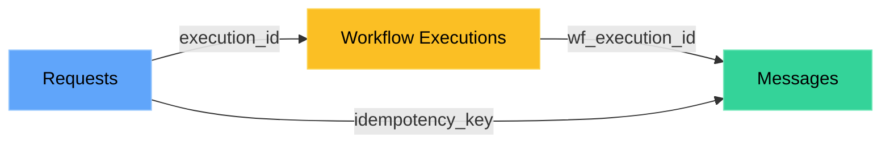

<Note>
**Old S3 connector (v1.0) will be deprecated over time:** If you’re using the existing S3 connector (v1.0), [migrate to v2.0](/docs/amazon_s3) to support the latest logging and analytics updates. The v2.0 connector exports all log types and notification analytics and fixes gaps in error logging present in v1.0.
</Note>

Export your SuprSend notification data directly to your S3 bucket. Build custom analytics dashboards, debug delivery issues, surface errors to your customers, or maintain compliance audit trails—all with data you fully own and control.

---

## How it works

- **Every 5 minutes**, SuprSend syncs your notification data to S3 in Parquet format. Data lands in hourly partitions across three data points, depending on your connector settings:

  ```
  your-bucket/
  ├── year=2025/month=01/day=15/hour=14/messages.parquet
  ├── year=2025/month=01/day=15/hour=14/workflow_executions.parquet
  └── year=2025/month=01/day=15/hour=14/requests.parquet
  ```
- At every sync, we **add or replace the existing hourly parquet files** where the data has been changed.
  - For query engines like AWS Athena, changes in hourly partitions are automatically detected and reflected in the final tables.
  - For data warehouses that don’t support automatic row overwrites (e.g., BigQuery), use the updated_at column to select the latest state of the data.
- **Data is encrypted with TLS 1.2+** in transit and **SSE-S3/SSE-KMS** at rest. 
- The Parquet format and partition structure work natively with query engines like Athena, Spark, and Presto. 
- If you pause sync, **data from the pause period backfills automatically** when you resume.


---

## What you can export

You can choose which data points to sync based on your use case. Each data point should be synced in a separate table in your data warehouse.
Most users sync **Messages for analytics and delivery troubleshooting**. For **internal logging, error analysis, and audit trails, you can sync all data points**.

### Data points

| Data point | What's in it | Use it for |
|---------|--------------|------------|
| **Messages** | Delivery status, engagement, vendor info, failures | Analytics, delivery troubleshooting |
| **Workflow Executions** | Step-by-step workflow logs | Debugging workflow level errors or computations like user preferences |
| **Requests** | API payloads and their responses | API debugging, Audit trails, Workflow Trigger level errors |


**Errors logged in each table:**
| Table | Errors |
|-------|--------|
| Requests | API level errors, workflow trigger level errors (condition mismatch, user not found, etc.) |
| Workflow Executions | Workflow level errors (dynamic variables in workflow could not be resolved, template rendering failed, webhook returned a 404 response, etc.) |
| Messages | Delivery failures |


### Table Schema

<Tabs>
<Tab title="Requests">

| Column name | Description | Datatype |
|------------|-------------|----------|
| api_type | Entity type for the API call | string |
| api_name | Workflow, event, or broadcast name passed in the API call | string |
| distinct_id_list | List of user `distinct_id` values or object type/id the request was sent for | array |
| actor | Actor passed in the event or workflow API request | string |
| tenant_id | Tenant ID for which the API request was sent | string |
| payload | Input payload passed in the trigger, including API call details | json |
| response | HTTP API response | json |
| metadata | SDK, machine, and location information for the request | json |
| errors | Request-level errors with message and severity | array(json) |
| executions | Workflow or broadcast execution IDs and slugs triggered by this API call. Execution IDs can be used to link with the workflow executions table | array(json) |
| idempotency_key | Idempotency key passed in the API request. A UUID is generated if not provided | string |
| created_at | Time when the request was received by SuprSend (UTC) | datetime |
| updated_at | Time when this entry was last updated | datetime |
| status | Status of the API request | string |

**status** can have these values:
- `completed`: request is successfully processed.
- `failure`: request failed to process due to some error
- `partial_failure`: request has been partially processed with some failure or has an acceptable warning (like workflow conditions evaluated to false)*
</Tab>

<Tab title="Workflow Executions">
| Column name | Description | Datatype |
|------------|-------------|----------|
| execution_id | Unique identifier for a workflow execution | string |
| recipient_distinct_id | User `distinct_id`; for objects, `object_type/id` | string |
| tenant_id | Unique identifier of the tenant | string |
| idempotency_key | Idempotency key passed in the API request. A UUID is generated if not provided | string |
| parent_object | Parent `object_type/id` when the workflow runs for subscribers | string |
| parent_object_execution_id | Execution ID of the parent object when triggered on an object | string |
| workflow_slug | Unique slug of the workflow | string |
| workflow_version | Version of the workflow | string |
| created_at | Time when the workflow execution started | datetime |
| updated_at | Time when the workflow step log was last updated | datetime |
| node_id | Unique identifier of the node | string |
| node_name | Name of the node | string |
| node_type | Type of the node | string |
| execution_stage | Current execution stage of the node | string |
| message | Short description of the event or error at this stage | string |
| status | Log status of the step (`error`, `warning`, `info`) | string |
| properties | Additional input or output data for the node execution | json |


</Tab>

<Tab title="Messages">

| Column name | Description | Datatype |
|------------|-------------|----------|
| wf_execution_id | Unique identifier for a workflow execution | string |
| broadcast_execution_id | Unique identifier for a broadcast execution | string |
| message_id | Message identifier; present only when there is no execution error | string |
| recipient_distinct_id | User `distinct_id`; for objects, `object_type/id` | string |
| tenant_id | Unique identifier of the tenant | string |
| idempotency_key | Idempotency key passed in the API request. A UUID is generated if not provided | string |
| parent_object | Parent `object_type/id` when the workflow runs for subscribers | string |
| parent_object_execution_id | Execution ID of the parent object when triggered on an object | string |
| workflow_slug | Unique slug of the workflow | string |
| template_name | Name of the template group | string |
| template_slug | Unique slug of the template | string |
| status | Delivery status of the message | string |
| created_at | Time when this entry was created | datetime |
| updated_at | Time when the message status was last updated | datetime |
| node_id | Unique identifier of the node | string |
| node_name | Name of the node | string |
| node_type | Type of the node | string |
| execution_failure_reason | Workflow execution–level failure details with severity | json |
| delivery_failure_reason | Failure reason returned by the vendor | string |
| triggered_at | Timestamp when SuprSend sent the message request to the vendor | datetime |
| delivered_at | Timestamp when the vendor reported delivery | datetime |
| seen_at | Timestamp when the message was seen by the user | datetime |
| clicked_at | Timestamp when the message was clicked by the user | datetime |
| dismissed_at | Timestamp when the message was dismissed by the user | datetime |
| vendor_ack_id | Vendor-generated identifier for this request | string |
| vendor_fallback_applicable | Indicates whether vendor fallback was enabled | boolean |
| vendor_fallback_level | Order in which this vendor was used during fallback (starts at 0) | integer |
| vendor_name | Vendor nickname configured in SuprSend | string |
| vendor_name_slug | Vendor identifier combining vendor type and channel | string |
| is_smart | Indicates if the node used smart channel routing | boolean |
| success_metric | Success metric defined for smart channel routing | string |
| success_achieved_at | Timestamp when the success metric was achieved | datetime |
| wait_time_in_seconds | Wait time between channels for smart routing | integer |
| channel_slug | Communication channel | string |
| channel_info | Channel-specific value (e.g., email address) | string |
| webhook_data | Request and response payload for webhook nodes | json |

</Tab>


</Tabs>

### Linking different data points

These data points are linked, allowing you to trace a notification from the initial API request to final delivery. The idempotency key is the common identifier across all tables and can be used to follow a single request end to end. Since the idempotency key is provided in the API request, you can also store it in your system to correlate SuprSend processing with your internal logs.



| From → To | Join on |
|-----------|---------|
| Requests → Workflow Executions | `execution_id` |
| Workflow Executions → Messages | `wf_execution_id` |
| Requests → Messages (shortcut) | `idempotency_key` |


## Setup

### Step 1: Create your S3 bucket

Open [AWS S3 Console](https://s3.console.aws.amazon.com/) and create a bucket with these settings:


- **Bucket name**: Something like `suprsend-logs-production` (save this—you'll need it)
- **Region**: Pick one close to you
- **Block all public access**: Yes
- **Encryption**: SSE-S3 (or SSE-KMS for compliance)


### Step 2: Create an IAM policy

This gives SuprSend permission to write to your bucket. In [IAM Console](https://console.aws.amazon.com/iam/), create a policy with this JSON:

```json
{
  "Version": "2012-10-17",
  "Statement": [{
    "Sid": "SuprSendS3ExportAccess",
    "Effect": "Allow",
    "Action": ["s3:PutObject", "s3:ListBucket", "s3:GetObject"],
    "Resource": [
      "arn:aws:s3:::YOUR_BUCKET_NAME/*",
      "arn:aws:s3:::YOUR_BUCKET_NAME"
    ]
  }]
}
```

Replace `YOUR_BUCKET_NAME` with your actual bucket name. Save it as something like `suprsend_s3_policy`.

### Step 3: Set up authentication

Two authentication methods are available:

| Method | When to use | We recommend |
|--------|-------------|--------------|
| **IAM Role** | Production, enterprise, multi-account setups | ✅ Yes—credentials rotate automatically, no secrets to manage |
| **IAM User** | Development, testing, quick POCs | Only if IAM Role isn't feasible. Requires manual key rotation every 90 days. |

<Tabs>
<Tab title="IAM Role (Recommended)">

**Use IAM Role when:**
- Running in production environments
- Security compliance requires no long-lived credentials
- You have multi-account AWS setups
- You want zero credential management overhead

**Steps to create IAM Role:**
1. In IAM Console → **Roles** → **Create Role**
2. Select **Another AWS Account** and enter SuprSend's account ID: `924219879248`
3. Attach the policy you just created
4. Name it (e.g., `suprsend_s3_role`)

Now configure the trust relationship. Generate an External ID at [uuidgenerator.net](https://www.uuidgenerator.net/), then update the trust policy:

```json
{
  "Version": "2012-10-17",
  "Statement": [{
    "Effect": "Allow",
    "Principal": { "AWS": "arn:aws:iam::924219879248:root" },
    "Action": "sts:AssumeRole",
    "Condition": { "StringEquals": { "sts:ExternalId": "YOUR_EXTERNAL_ID" }}
  }]
}
```

**Save these for the next step:** Role ARN + External ID (case-sensitive, no extra spaces)

</Tab>

<Tab title="IAM User">

**Use IAM User when:**
- Setting up for development or testing
- Quick proof-of-concept needed
- IAM Role setup isn't feasible in your environment

<Warning>IAM User credentials require manual rotation every 90 days for security compliance.</Warning>

**Steps to create IAM User:**
1. In IAM Console → **Users** → **Add users**
2. Name it (e.g., `suprsend-s3-connector`)
3. Attach your policy
4. Go to **Security credentials** → **Create access key** → **Third party service**


**Save immediately:** Access Key ID + Secret Access Key to add in the next step (AWS won't show the secret again)

</Tab>
</Tabs>

### Step 4: Connect in SuprSend

Go to **Settings** → **Connectors** → **Amazon S3 v2.0** → **Add Connector**

<Tabs>
<Tab title="IAM Role">


</Tab>
<Tab title="IAM User">


</Tab>
</Tabs>

Enter your AWS credentials, select which data points to export, then **Save** and toggle **Enable sync**.

### Step 5: Verify it's working

Give it about 10 minutes, then check your S3 bucket. You should see folders like `year=2025/month=01/...` appearing.

<Warning>
Nothing showing up? Jump to [FAQs](#faqs) for troubleshooting steps.
</Warning>

---

## Best practices

<AccordionGroup>
<Accordion title="Security">

- Use IAM Role in production—no keys to manage
- Never commit credentials to git
- Keep your bucket private with encryption enabled (SSE-S3 or SSE-KMS)
- Block all public access to your bucket

</Accordion>

<Accordion title="Managing roles & permissions">

- **Use IAM Role for production**—credentials rotate automatically, no secrets to manage
- **Rotate IAM User keys every 90 days**—required for security compliance
- **Use External ID for IAM Roles**—prevents "confused deputy" attacks
- **Assign policies to groups, not users**—simplifies permission management

</Accordion>

<Accordion title="Data syncing & querying">

- **Sync only what you need**—for analytics, Messages is often enough. Add Workflow Executions and Requests for debugging.
- **Use `updated_at` for incremental queries**—`updated_at` tells you when a given row was last updated. You can filter by this field instead of scanning all data when you just need to recently updated data, especially while fetching logs.
- **Clean up old data regularly**— we always append new data. So, your files can accumulate over time. It's better to clean up old data regularly to avoid unnecessary storage costs.

</Accordion>
</AccordionGroup>

---

## FAQs

<AccordionGroup>
<Accordion title="Files not appearing?">

Work through this checklist:

1. **Wait 10 minutes**—first sync takes time
2. **Check bucket name**—must match exactly, case-sensitive
3. **Check region**—must match in both AWS and SuprSend
4. **Check IAM**—Check if the Role ARN, Access Key and External ID are correct.
5. **Check policy**- See if the policy has these actions: `"Action": ["s3:PutObject", "s3:ListBucket", "s3:GetObject"]` assigned to the right bucket.

</Accordion>

<Accordion title="How do I know it's working?">
It should work if the AWS setup is correct and in  SuprSend → **Settings** → **Connectors** → **Amazon S3 v2.0**, you see:
- Sync toggle is ON
- Status shows "Active"
- At least one dataset selected

</Accordion>

<Accordion title="Missing data?">

- Data point might not be selected—check your export settings
- When setting up the connector first time, data points only export going forward (no historical backfill)
- Were notifications actually sent during that time?
- If sync was paused, data backfills when you resume

<Note>If you still find some gap in data, please contact support.</Note>

</Accordion>

<Accordion title="How does backfilling work?">

| What you did | What happens |
|--------------|--------------|
| Paused then resumed | Backfills everything from the pause |
| Added a new dataset | Starts fresh, historical data will not be backfilled |
| Re-enabled a dataset | Backfills from when it was disabled |

</Accordion>

<Accordion title="Can I change data points later?">

Absolutely:
- **Add one**: Starts exporting going forward
- **Remove one**: Stops syncing, data stays in S3
- **Re-enable**: Backfills automatically

</Accordion>
</AccordionGroup>
