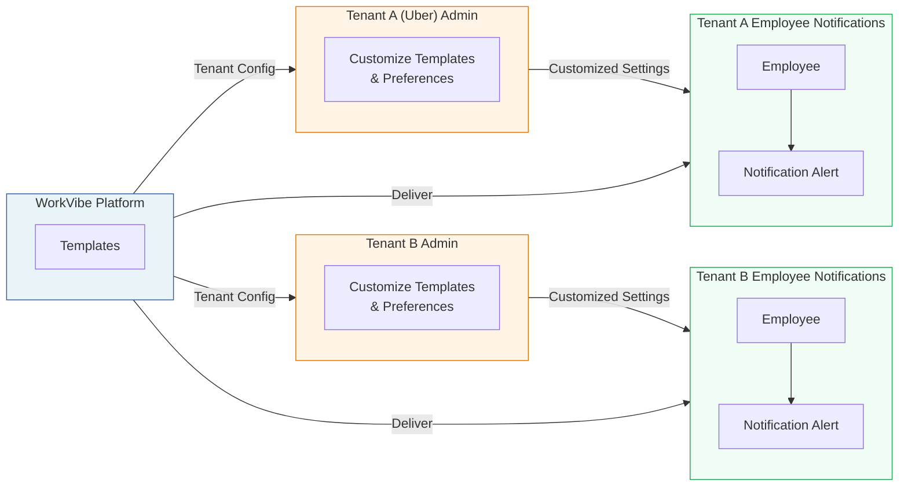

Multi-tenant platforms operate a *shared notification infrastructure* across multiple customer organizations (tenants). The core requirement is *tenant-scoped customization*: notification types must dynamically adapt based on tenant context—preference configurations, template variants with localization, and routing policies (channel selection and vendor assignment).

This guide demonstrates how to architect this model in SuprSend using an example employee engagement platform called **WorkVibe**. We use WorkVibe as our example throughout this guide. The platform enables customer organizations to send employee communications including onboarding sequences, performance review notifications, pulse survey invitations, recognition messages, and policy update alerts.

<Note>
**Example scenario:** **Uber** serves as an example tenant of the WorkVibe platform. Uber leverages WorkVibe's infrastructure to deliver alerts to its employee base. The notification system must enable tenant-level customization within WorkVibe's platform:

- Template variants with tenant-specific content, tone, and localization

- Admin level channel configuration (email, Slack, SMS, etc.) per notification type 

- Employee-level preference management

- Tenant branding and sender identity configuration (e.g., hr@uber.com)

All customization occurs within a single shared, multi-tenant notification infrastructure.

</Note>

---

## WorkVibe Architecture Overview

This example assumes WorkVibe implements the following notification architecture, standardized across all tenant organizations:




The following sections detail how to model this architecture in SuprSend, enabling notification delivery across multiple tenants without template or workflow duplication.

---

## WorkVibe Concept Mapping to SuprSend 

| WorkVibe Platform | SuprSend Entity | Example |
|:------------------|:---------|:--------|
| **Environments** | **[Workspace](/docs/what-is-suprsend#workspaces)** | Dev, Staging, Pre-prod, Prod |
| **Customer Organization** | **[Tenant](/docs/tenants)** | Uber (`tenant_id: uber`) |
| **Employee** | **[User](/docs/users)** | Employee entity with email, phone, and profile attributes (`distinct_id: employee1`) |
| **Orchestration Logic** | **[Workflows](/docs/workflows)** | Onboarding workflow: welcome email → first week check-in → manager introduction |
| **Message Templates** | **[Templates](/docs/templates)** | New hire welcome alert template supporting Email and SMS channels |
| **Organization-level Controls** | **[Notification Categories](/docs/notification-category)** | `onboarding.new_hire_welcome` |
| **Employee Preferences** | **[User Preferences](/docs/user-preferences)** | Employee opt-in/opt-out configuration for notification categories |

---

## Data Modeling in SuprSend

Implement the following components to model the multi-tenant notification architecture in SuprSend:

### 1. Tenants

We create tenant entities for each customer organization programmatically via the SuprSend API or SDK. Each tenant entity stores branding attributes (logo, website, brand colors) along with custom properties required for personalization and tenant-scoped configuration.

**Required fields:**

<Card title="Example: Uber tenant configuration" icon="gear">
  <ul>
    <li><strong>tenant_id:</strong> <code>uber</code> </li>
    <li><strong>tenant_name:</strong> Uber </li>
    <li><strong>logo:</strong> https://assets.yourdomain.com/tenants/uber/logo.png </li>
    <li><strong>primary_color:</strong> #000000 </li>
    <li><strong>timezone:</strong> America/Los_Angeles </li>
  </ul>
</Card>

Beyond branding properties, SuprSend enables tenant-level configuration of notification preferences and vendor routing policies.

📘 [Tenants →](/docs/tenants) | [Node.js SDK →](/docs/node-tenants) | [Python SDK →](/docs/python-tenants) | [Go SDK →](/docs/tenants-go)

---

### 2. Notification Categories

We create notification categories that map to WorkVibe's notification types. These categories are linked to Workflows and Preference configurations. SuprSend provides **Sections** and **Sub-categories** to organize notification categories hierarchically.

For WorkVibe, we organized the notification category structure as follows:

- **Section:** Product area (e.g., `Onboarding & Lifecycle`, `Feedback & Engagement`)

- **Sub-category:** Notification type (e.g., `New Hire Welcome`, `First Week Check-in`, `Manager Feedback Request`)


📘 [Notification Categories →](/docs/notification-category) | [Create categories →](https://app.suprsend.com/en/staging/developers/preference-categories)

---

### 3. Preferences

SuprSend implements a four-layer preference evaluation system to determine notification delivery channels. For WorkVibe, tenant administrators can configure which notifications are applicable for their organizations:

<CardGroup cols={2}>
  <Card title="Universal Set (U)" icon="globe">
    All categories defined by WorkVibe platform
  </Card>
  <Card title="Visible to Tenant (T1)" icon="eye">
    WorkVibe platform controls category visibility per tenant
  </Card>
  <Card title="Configured by Tenant Admins (T2)" icon="user-shield">
    Tenant administrators can disable categories/channels within WorkVibe's application
  </Card>
  <Card title="End user Preferences (S)" icon="user">
    Employees can opt-in/opt-out at category/channel granularity
  </Card>
</CardGroup>

**Evaluation mechanism:**

SuprSend computes final delivery channels by applying platform rules, tenant-level controls, and user preferences in sequence.

**Evaluation formula:** `Final Channels = U ∩ T1 ∩ T2 ∩ S`

**Example: Channel evaluation**

| Layer | Email | SMS | Slack |
|-------|-------|-----|-------|
| **WorkVibe Platform (U)** | ✅ | ✅ | ✅ |
| **Uber visibility (T1)** | ✅ | ✅ | ✅ |
| **Uber admin (T2)** | ✅ | ❌ | ✅ |
| **Employee (S)** | ✅ | ✅ | ❌ |
| **Final result** | **✅** | ❌ | ❌ |

#### Expose Preferences to Customer Organizations

Enable each tenant (Uber) to manage notification preferences within the WorkVibe administrative interface.

WorkVibe implements an admin-only *Notification Settings* page within its application. This interface integrates with SuprSend's Tenant Preference APIs, authenticated via JWT scoped to the specific tenant, to fetch and update notification category configurations.

This approach maintains UI and UX control within WorkVibe, integrates with existing admin dashboards, and enables tenant administrators to configure organization-level notification policies without leaving the WorkVibe platform.

📘 [Tenant Preferences →](/docs/tenant-preference) | [User Preferences →](/docs/user-preferences) | [Preference Evaluation →](/docs/preference-evaluation) | [Embedded Preferences →](/docs/embedded-preference-centre)

---

### 4. Templates

We create templates for each notification type. For the new employee onboarding use case, we created the `NEW_HIRE_WELCOME_ALERT` template. Templates utilize tenant-scoped variables for tenant-specific rendering by default.

<Note>
**Template reuse:** We create templates once at the platform level and render them at delivery time with tenant-specific branding. Templates can be exposed to tenant administrators for customization. This approach eliminates template duplication per tenant while maintaining fully branded communication.
</Note>

**Template variables:**

Templates use standardized snake_case field naming and Handlebars variable syntax (e.g., `{{variable}}`). All channels (email, SMS, WhatsApp, push) follow consistent variable structures. 

```
// Data variables
{{employee_name}}          → "Sarah Chen"
{{start_date}}              → "2026-01-15"
{{manager_name}}            → "John Doe"
{{department}}              → "Engineering"

// Tenant branding
{{$tenant.logo}}            → Uber logo URL
{{$tenant.primary_color}}   → "#000000"
{{$tenant.tenant_name}}     → "Uber"

// Recipient info
{{$recipient.name}}         → "Sarah Chen"
{{$recipient.email}}        → "sarah@uber.com"
```

##### Email Template


##### SMS Template


#### Expose Templates to Customer Applications

A common requirement is enabling tenant organizations (like Uber) to customize templates through embeddable template editors. WorkVibe exposes template editing capabilities to tenant administrators within a *Notification Settings* section.

**Implementation:**

- **Template fetching:** We load all templates created by WorkVibe in the SuprSend platform.

- **Variant creation:** Tenant organizations can edit existing variants or create new tenant-specific variants.

- **Variant selection:** SuprSend automatically resolves the most specific variant based on tenant ID, language, and custom conditions.

**Scoped JWT Authentication:**

SuprSend uses scoped JWT authentication to securely expose templates. This ensures each tenant can only access and modify templates scoped to their tenant ID.

📘 [Templates →](/docs/templates) | [Embeddable Template Editor](/docs/embeddable-templates) | [JWT Authentication →](/docs/client-authentication)

---

### 5. Workflows

**Workflows** define the orchestration logic for notifications—the sequence of steps, conditional branches, delays, and channel assignments used to deliver messages. For WorkVibe, we created a workflow for new employee onboarding that delivers a welcome email on day one, a first-week check-in survey on day seven, and a manager introduction Slack message on day ten.

Each workflow has a unique **workflow slug** that identifies it when triggering notifications. The workflow slug is used in the trigger payload to specify which workflow to execute.

**Workflow Configuration:**

- **Workflow slug:** A unique identifier for the workflow (e.g., `new_employee_onboarding`)
- **Category link:** We link workflows to notification categories to enable preference evaluation
- **Template link:** Workflows reference templates for each channel (email, SMS, Slack, etc.)


SuprSend supports workflow creation through three methods. For WorkVibe, we created workflows using the UI Builder. Workflows can also be created and managed via MCP (Model Context Protocol) for programmatic workflow management.

<Tabs>
  <Tab title="UI Builder">
    Workflows are constructed visually in the SuprSend dashboard using drag-and-drop nodes, conditional logic, and delay configurations. Workflows are created and managed through the administrative UI.
    
    **When to use:**
    - Non-engineering teams create and modify workflows
    - Workflows require frequent iteration and rapid changes
    - Workflows are version-controlled or promoted across environments via CLI after creation
  </Tab>

  <Tab title="Dynamic Workflows">
    Notifications are triggered programmatically without pre-creating workflow definitions in the UI. This generates a dynamic workflow that cannot be modified from the UI.
    
    **When to use:**
    - Single-step transactional notifications (example: email verification)
    - Rapid deployment without workflow setup overhead
  </Tab>

  <Tab title="Workflows API">
     Create and update workflows programmatically using the Management API. Workflows are defined as code and synchronized to SuprSend via API.
    
    **When to use:**
    - Workflows are version-controlled in the codebase
    - Infrastructure-as-code approach for workflow management
    - CI/CD pipeline integration for workflow deployment
    - Bulk workflow creation or migration scenarios
    - Platform controls business logic programmatically
  </Tab>
</Tabs>

📘 [Workflows →](/docs/workflows) | [Dynamic Workflow Trigger →](/reference/dynamic-workflow-trigger) | [Workflows API →](/reference/create-update-workflow)

---

### 6. Tenant Vendors (Optional)

Enterprise tenants may require dedicated SMTP servers or vendor accounts for deliverability, compliance, or branding requirements. In WorkVibe's implementation, tenant Uber requires its own SMTP domain. We configured Uber's SMTP as a custom property in the SuprSend tenant entity, which can be referenced in the `from_email` field in templates. For SMS, Uber uses its own SMS provider, which we configured as a tenant vendor.

<Info>
**Vendor fallback chain:** If Uber's SMS vendor fails, notifications automatically fallback to WorkVibe's default SMS provider.
</Info>


📘 [Tenant Vendors →](/docs/tenant-vendor) | [Vendor Fallback →](/docs/vendor-fallback)

---

## End-to-End Notification Flow

Once the setup is complete (we've configured tenants, categories, preferences, templates, workflows, and vendors), you can trigger workflows to send notifications. When WorkVibe triggers a workflow, SuprSend executes the following sequence automatically:

<Steps>
  <Step title="Workflow Trigger">
    WorkVibe triggers the workflow with `tenant_id: "uber"` in the payload. The workflow trigger payload must include the `tenant_id` to enable tenant-scoped customization.
    
    Here's an example trigger payload for the new employee onboarding workflow:
    
    ```json
    {
      "workflow": "new_employee_onboarding",
      "tenant_id": "uber",
      "data": {
        "employee_name": "Sarah Chen",
        "start_date": "2026-01-15",
        "manager_name": "John Doe",
        "department": "Engineering"
      },
      "recipient": {
        "distinct_id": "employee1",
        "email": "sarah@uber.com"
      }
    }
    ```
    
    **Key fields:**
    - **workflow:** The workflow slug that identifies which workflow to execute
    - **tenant_id:** Required field that enables tenant-specific branding, preferences, and vendor routing
    - **data:** Event data variables used in template rendering
    - **recipient:** User information for notification delivery
  </Step>
  <Step title="SuprSend Identifies Tenant">
    SuprSend uses the `tenant_id` from the trigger payload to identify the tenant and resolve tenant-specific configurations. The workflow is linked to a notification category, which enables preference evaluation.
  </Step>
  <Step title="Workflow → Category & Template Link">
    SuprSend resolves the workflow's linked category (`onboarding.new_hire_welcome`) and associated templates for each channel. The workflow slug maps to the appropriate templates.
  </Step>
  <Step title="Apply Uber Branding">
    SuprSend applies Uber's tenant branding (logo, colors, tenant name) to the templates using tenant-scoped variables (`{{$tenant.logo}}`, `{{$tenant.primary_color}}`, etc.).
  </Step>
  <Step title="Apply Tenant Preferences">
    Evaluates Uber's tenant-level defaults for `onboarding.new_hire_welcome`: Email enabled, SMS disabled, Slack enabled.
  </Step>
  <Step title="Apply Employee Preferences">
    Employee preference evaluation: Employee opts out of Slack → Final channel selection: Email only.
  </Step>
  <Step title="Resolve Template">
    Checks for tenant-specific template variant. Falls back to default `NEW_HIRE_WELCOME_ALERT` template with Uber branding variables applied.
  </Step>
  <Step title="Route via Vendor">
    Routes through Uber's configured vendor if available, otherwise uses WorkVibe platform default vendor.
  </Step>
  <Step title="Deliver">
    Notification delivered with Uber branding and onboarding details across selected channels.
  </Step>
</Steps>


---

## Other Common Scenarios

This data modeling approach applies to various multi-tenant marketplaces and platform architectures, including B2B2B (business-to-business-to-business) and B2B2C (business-to-business-to-consumer) scenarios:

<CardGroup cols={2}>
  <Card title="Travel booking platforms" icon="plane">
    Travelers receive confirmations branded by hotels/airlines, with tenant-specific preference configurations and vendor routing policies
  </Card>
  <Card title="Food delivery marketplaces" icon="utensils">
    Customers receive order updates branded by restaurants, each with tenant-specific branding and notification preference settings
  </Card>
  <Card title="E-commerce marketplaces" icon="store">
    Shoppers receive purchase confirmations branded by sellers, with per-seller branding and vendor configuration
  </Card>
  <Card title="Delivery and logistics platforms" icon="truck">
    Customers receive delivery updates branded by logistics providers, with real-time tracking notifications and tenant-specific branding
  </Card>
  <Card title="Event ticketing platforms" icon="ticket">
    Attendees receive tickets branded by event organizers, with organizer-level preferences and custom SMTP configuration
  </Card>
  <Card title="Learning platforms" icon="graduation-cap">
    Students receive course updates branded by educational institutions, with institution-specific branding and channel configurations
  </Card>
  <Card title="Healthcare scheduling platforms" icon="heart">
    Patients receive appointment reminders branded by clinics, with clinic-level preferences and compliance-compliant routing
  </Card>
  <Card title="B2B2B platforms" icon="building">
    Enterprise customers receive notifications branded by their organization, with multi-level tenant hierarchies and custom vendor routing
  </Card>
  <Card title="B2B2C platforms" icon="users">
    End consumers receive notifications branded by the business customer, with tenant-level customization and preference management
  </Card>
</CardGroup>

---
