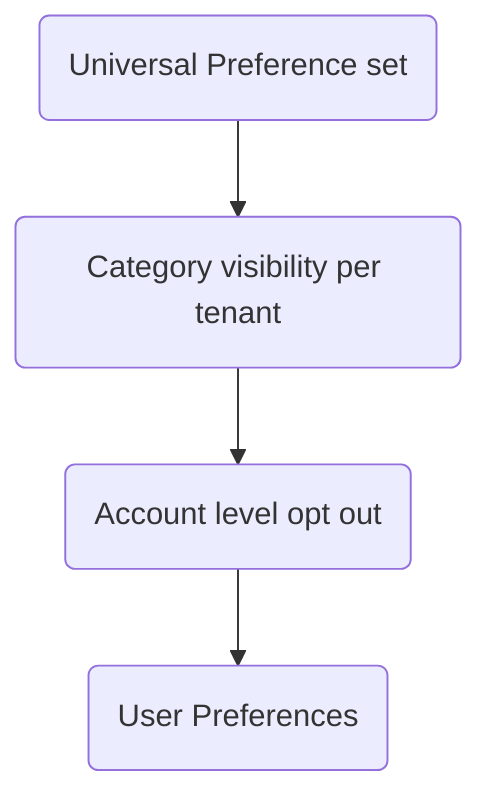

## Overview

This guide shows how to model multi-tenant B2B platforms in SuprSend where each customer organization has different product areas, admins launch recurring campaigns or periods, and notifications need customization per organization or per campaign.

**Platform structure:**
- Each **customer organization** has multiple **product areas** (features with their own communications)
- Within product areas, admins launch **campaigns or periods** such as recurring sprints, review periods, or marketing campaigns
- Each campaign has multi-step, multi-channel communications with defaults provided by the platform and optional per-organization/per-campaign customization
- Platform provides default workflow steps and default templates (can be customized)
- **Branding** set at organization level (logo, colors) and applied globally; **content** can be overridden at campaign level
- Goal: unified, consistent, granular controls across all product areas

**Concept hierarchy:** Organization → Product Area → Event Type → Campaign → Message Step

**Example:** In a project management platform, each organization (e.g., "Acme Corp") is a tenant. They have different product areas like "Software Development" and "Marketing Projects". When an event occurs during a specific campaign (e.g., "Sprint 2024-Q1"), the platform sends notifications with Acme Corp branding, using default templates that can be customized per campaign, supporting multi-channel delivery (email, Slack, Teams) while respecting user preferences.

---

## Concept Mapping

Map your platform concepts to SuprSend:

| Your Platform | Meaning | SuprSend Concept | Notes |
| --- | --- | --- | --- |
| **Customer Organization** | A customer organization | **Tenant** | Branding lives here; global defaults & policies |
| **Product Area** | Feature or section with its own communications | - | No need for mapping. Manage as tags in Templates / Workflows |
| **Event Type** | Type of event that triggers notifications | Templates & Workflow | - |
| **Campaign or Period** | A launched instance (e.g., sprint, campaign, review period) | - | No need for mapping. Manage as Variants in templates and tags in workflows |
| **Default Templates** | Platform-provided copies | **Templates** | Stored once; referenced across all organizations and campaigns |
| **Template Overrides for Campaigns** | Edits for a specific campaign | **Template Variants** | Variant key = `tenant + campaign`; falls back to `default` with `tenant` branding if no override |
| **Workflow Steps** | Initial notification, reminders, alerts | **Dynamic Workflow** (recommended) | Workflows managed within your platform. Each step is an individual workflow in SuprSend, dynamically triggered |
| **Recipient** | End user receiving notifications | **User** (distinct_id) / **ListObject** | Channel identities (email, Slack, Teams) mapped here |
| **Organization Preferences - Product Area & Event Type** | Product Area → Event Type | **Notification Categories:** Section: Product Area, Sub-category: Event Type | - |
| **Organization Preferences - Campaign** | Campaign-specific preferences | - | Campaign level preferences managed within your platform. Passed dynamically during workflow trigger |
| **User Preferences** | Channel and product area preference for a user | **User Preferences** | - |

<Note>
**Template Overrides for Campaigns** depend on Variants support in Templates, available with Templates API v2.0.
</Note>

---

## Implementation Steps

Follow these steps in order to set up your multi-tenant notification system.

### Step 1: Set Up Tenants

Create a tenant for each customer organization. Branding (logo, colors) stored here applies to all notifications automatically. For example, create a tenant for "Acme Corp" with their logo and brand colors.

<Steps>
  <Step title="Create tenant">
    Use your platform's organization ID as the tenant ID in SuprSend.
  </Step>
  <Step title="Set branding">
    Add logo URL, primary color, secondary color, social links. These become available as `$tenant.*` variables in templates.
  </Step>
  <Step title="Configure category visibility">
    Set which notification categories are visible to this organization based on product areas they have access to.
  </Step>
</Steps>

[Learn more about tenants →](/docs/tenants)

---

### Step 2: Create Templates

Create a template for each **event type** and **message step** (initial, reminder1, reminder2, alert).

For example, create templates like:
- `ISSUE_ASSIGNED_INITIAL_EMAIL` - Initial notification when issue is assigned
- `ISSUE_ASSIGNED_REMINDER1_EMAIL` - First reminder if not acknowledged
- `ISSUE_ASSIGNED_REMINDER2_EMAIL` - Second reminder
- `ISSUE_ASSIGNED_INITIAL_SLACK` - Slack version of initial notification

<Steps>
  <Step title="Use naming pattern">
    Use a consistent pattern: `{EVENT_TYPE}_{STEP}_{CHANNEL}` (e.g., `ISSUE_ASSIGNED_INITIAL_EMAIL`)
  </Step>
  <Step title="Reference tenant variables">
    Use `$tenant.tenant_name`, `$tenant.logo`, `$tenant.primary_color` in templates. These automatically resolve to the tenant's branding.
  </Step>
  <Step title="Create for each combination">
    Create templates for: Event type × Message step × Channel
  </Step>
</Steps>

[Learn more about templates →](/docs/templates)

---

### Step 3: Handle Campaign-Specific Overrides

When an organization admin edits content for a specific campaign, create a template variant. For example, if Acme Corp admin customizes the "Issue Assigned" notification content for "Sprint 2024-Q1", create a variant with `tenant=acme_corp`, `campaign=sprint-2024-q1`.

<Steps>
  <Step title="Create variant">
    Store as **Variant** with scope: `tenant={tenant_id}`, `campaign={campaign_id}`
  </Step>
  <Step title="Automatic resolution">
    SuprSend automatically resolves:
    - If variant exists: uses variant (custom content)
    - If no variant: uses template + tenant branding (default content)
  </Step>
</Steps>

**Variant precedence** (highest → lowest): `tenant+campaign` → `template default`

<Warning>
**Template Variants require Templates API v2.0.** Until available, pass campaign-specific content as dynamic data in workflow triggers using template variables.
</Warning>

---

### Step 4: Set Up Notification Categories

Create notification categories to organize communications and enable preference management.

For example:
```
Transactional Category
  └─ Software Development (Section)
      ├─ Issue Assigned (Sub-category)
      ├─ Issue Resolved (Sub-category)
      └─ Issue Commented (Sub-category)
  └─ Marketing Projects (Section)
      └─ Campaign Launched (Sub-category)
```

<Steps>
  <Step title="Create category structure">
    Organize as: Section = Product Area name, Sub-category = Event Type
  </Step>
  <Step title="Set default preferences">
    Configure default preferences for each sub-category.
  </Step>
</Steps>

[Learn more about notification categories →](/docs/notification-category)

---

### Step 5: Choose Your Workflow Approach

<AccordionGroup>
  <Accordion title="Method A: Dynamic Workflows (Recommended for Initial Rollout)" defaultOpen>
    Your platform continues to own workflow orchestration logic. Each workflow step (initial notification, first reminder, final reminder, alert) is treated as a **separate dynamic workflow** created and triggered on SuprSend **at runtime**.

    **Campaigns managed as tags**

    Campaigns are tags within workflows, dynamically passed for filtering workflow logs.

    For example, when an issue is assigned during Sprint 2024-Q1:
    1. Platform triggers "Issue Assigned - Initial" workflow with `campaign=sprint-2024-q1` tag
    2. If not acknowledged after 24 hours, platform triggers "Issue Assigned - Reminder 1" workflow with same campaign tag
    3. All notifications for this sprint can be filtered by `campaign=sprint-2024-q1` tag

    **Implementation Steps**

    <Steps>
      <Step title="Create templates in SuprSend">
        Create all templates for your notification types.
      </Step>
      <Step title="Define notification categories">
        Create a list of notification categories in SuprSend.
      </Step>
      <Step title="Store template mappings">
        Store `template_slugs` in your platform's codebase mapped to their respective events or triggers.
      </Step>
      <Step title="Trigger workflow dynamically">
        When a communication event occurs, trigger a workflow in SuprSend with:
        - `workflow_name`
        - `template_slug`
        - `recipients` (users, list, or object)
        - `notification_category`
        - applicable `channel` list
        - `tenant_id`
        - optional `tags` such as `event_type` and `campaign`
      </Step>
      <Step title="SuprSend handles execution">
        SuprSend automatically handles: template resolution (including variant selection and tenant branding), template rendering, preference checks, multichannel delivery, and analytics.
      </Step>
    </Steps>

    **Pros:**
    - Dynamic workflow creation at runtime (via API) when a new campaign is triggered; no pre-creation required on UI
    - Faster go-live: works with existing orchestration and scheduling logic; easy migration
    - Minimal development effort: only requires triggers and mapping templates to triggers
    - Low-risk integration: no dependency on new logic migration; existing flows remain intact

    **Cons:**
    - No visual orchestration: flows aren't visible in the UI, managed entirely inside code
    - Dependent on engineers: changes in workflows require code changes
    - Less workflow-level insight: analytics are per notification, not end-to-end flow

    [Dynamic Workflow Trigger →](/reference/dynamic-workflow-trigger)
  </Accordion>

  <Accordion title="Method B: Native Workflows in SuprSend">
    Your platform gradually migrates workflow orchestration into SuprSend using SuprSend's **Workflow Builder**. Each notification journey (e.g., Issue Assigned Flow, Issue Resolved Flow) becomes a **native workflow in SuprSend**, defined visually via the dashboard or programmatically through APIs.

    Each node within the workflow can represent a communication step or condition, and can include **wait timers, conditional branches, data checks** (dynamically populated based on customer customization).

    This enables greater flexibility & control for non-engineering stakeholders and potentially allows **customer admins** to manage limited configuration or dynamic steps in the future.

    For example, create a native workflow "Issue Assigned Flow" with:
    - Initial notification node (immediate)
    - Wait 24 hours node
    - Conditional branch: if not acknowledged → Reminder 1 node
    - Wait 48 hours node
    - Conditional branch: if still not acknowledged → Reminder 2 node

    **Implementation Steps**

    <Steps>
      <Step title="Create templates">
        Create templates in SuprSend.
      </Step>
      <Step title="Define notification categories">
        Define notification categories aligned with product areas.
      </Step>
      <Step title="Create native workflows">
        Create native workflows in SuprSend, linking each workflow with the appropriate templates.
      </Step>
      <Step title="Trigger workflow">
        Trigger a workflow execution using the `workflow_slug`.
      </Step>
      <Step title="SuprSend executes">
        SuprSend executes the full workflow — processing wait conditions, branches, and logic — and delivers notifications after resolving the right template variant, tenant branding, and user preferences.
      </Step>
    </Steps>

    [Workflow Execution →](/reference/dynamic-workflow-trigger)
  </Accordion>
</AccordionGroup>

### Recommendation

Adopt **Method A (Dynamic Workflows)** for the **initial rollout**, and gradually transition to **Method B (Native Workflows)** once there is a need to manage workflows by your platform's product teams or if workflow configs are to be exposed to customer admins.

---

### Step 6: Configure Preferences

SuprSend supports multi-layered preference management, enabling both **tenant-level controls** (for organizational governance) and **end-user controls** (for personal opt-in/out decisions).

#### Preference Hierarchy

Adding `tenant` context creates hierarchical preference control:



#### Setup Steps

For example:
- Universal Set: All event types (Issue Assigned, Issue Resolved, Issue Commented, etc.)
- Organization Visibility: Acme Corp only has "Software Development" product area → Hide "Marketing Projects" categories
- Organization Admin: Acme Corp admin disables Slack notifications for "Issue Commented"
- User Preferences: Developer prefers email for "Issue Assigned" but Slack for "Issue Resolved"
- Campaign-Level: Sprint 2024-Q1 should only send via email (passed as `channel_list` in trigger)

<Steps>
  <Step title="Define Universal Set (U)">
    Create the master list of categories/subcategories defined by your platform (e.g., Issue Assigned, Issue Resolved, Campaign Launched, etc.), optionally including workflow-step granularity.
  </Step>
  <Step title="Configure Organization Visibility (U → T1)">
    Choose which preferences to expose to each organization based on product areas they have access to. Hide categories for organizations without access to certain product areas.
  </Step>
  <Step title="Enable Organization Admin Configuration (T1 → T2)">
    Allow organization admins to disable certain categories or channels for their organization.
  </Step>
  <Step title="Set Up User Preferences (S)">
    Enable individual users to manage their own notification preferences at category / sub-category level. Users can opt-in or opt-out at:
    - Category level (e.g., Issue Assigned)
    - Channel level (e.g., Email, Slack, Teams)
    - Category × Channel combinations (e.g., receive Issue Assigned via Email but not Slack)
  </Step>
  <Step title="Handle Campaign-Level Preferences">
    For specific campaigns, maintain preferences within your platform's scope and pass as `channel_list` during the workflow trigger.
  </Step>
</Steps>

#### Execution Flow

When a workflow is triggered, the following sequence occurs:

For example, when an issue is assigned to a developer during Sprint 2024-Q1:
1. Platform sends trigger with `tenant_id=acme_corp`, `notification_category=issue_assigned`, `campaign=sprint-2024-q1`
2. SuprSend checks: Is "Issue Assigned" enabled for Acme Corp? ✓
3. SuprSend checks: Is email enabled for this developer? ✓
4. Final delivery: Email sent (if both checks pass)

<Steps>
  <Step title="Trigger Received">
    Your platform sends a workflow trigger containing `tenant_id`, `recipient_id`, `notification_category`, and `channel_list`
  </Step>
  <Step title="Tenant Preference Evaluation">
    SuprSend checks that the **category & channels** are enabled for the tenant
  </Step>
  <Step title="User Preference Evaluation">
    SuprSend checks that the **category & channels** are enabled for the user
  </Step>
  <Step title="Final Channel Resolution">
    The effective delivery channels are derived as: **U ∩ T1 ∩ T2 ∩ S**
  </Step>
</Steps>

**Relevant APIs**

- [Tenant Preferences](/reference/update-tenant-default-preference)
- [User Preferences](/reference/update-user-category-preference)

---

## Next Steps

<CardGroup cols={2}>
  <Card title="Set Up Tenants" icon="building" href="/docs/tenants">
    Create and configure tenants for your organizations
  </Card>
  <Card title="Create Templates" icon="file-lines" href="/docs/templates">
    Build your primary notification templates
  </Card>
  <Card title="Notification Categories" icon="tags" href="/docs/notification-category">
    Organize and structure your notification categories
  </Card>
  <Card title="Dynamic Workflows" icon="code" href="/reference/dynamic-workflow-trigger">
    Trigger your first dynamic workflow
  </Card>
</CardGroup>
