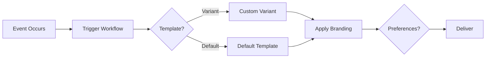
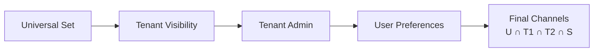

## Overview

This guide explains how to model multi-tenant B2B platforms in SuprSend. It covers setting up branded notifications per organization, custom messaging for campaigns, and user-controlled delivery preferences.

<CardGroup cols={3}>
  <Card title="What You'll Build" icon="rocket">
    Branded notifications per organization with automatic tenant customization
  </Card>
  <Card title="Key Features" icon="star">
    Multi-layered preferences, dynamic workflows, and template variants
  </Card>
  <Card title="Use Cases" icon="briefcase">
    B2B platforms like Jira, project management tools, and SaaS platforms
  </Card>
</CardGroup>

---

## Understanding Your Platform Structure

Most B2B platforms follow this hierarchical structure:

<CardGroup cols={1}>
  <Card title="Platform Hierarchy" icon="sitemap">
    ```
    Organization (Acme Corp)
      └─ Module (Software Development)
          └─ Event Type (Issue Assigned, Issue Resolved)
              └─ Cycle (Sprint 2024-Q1)
                  └─ Notification Step (Initial, Reminder 1, Reminder 2)
    ```
  </Card>
</CardGroup>

When an event occurs, you send notifications with organization branding, use default templates, allow custom content for cycles, and respect user preferences. SuprSend handles this automatically once you model your platform correctly.

<Info>
**Key insight:** Model your platform structure once, and SuprSend handles branding, customization, and preferences automatically for all organizations.
</Info>

---

## How It Works

Here's the notification flow from trigger to delivery:



<CardGroup cols={3}>
  <Card title="1. Your Platform" icon="code">
    Triggers workflow when events occur
  </Card>
  <Card title="2. SuprSend" icon="sparkles">
    Picks template, applies branding, checks preferences
  </Card>
  <Card title="3. User Receives" icon="envelope">
    Branded notification on preferred channel
  </Card>
</CardGroup>

<Tip>
**Example:** When an issue is assigned in Acme Corp's Sprint 2024-Q1, your platform triggers a workflow. SuprSend selects the appropriate template (variant if custom content exists, otherwise default), applies Acme Corp's branding, evaluates preferences across all layers, and delivers a branded email to the user on their preferred channel.
</Tip>

---

## Platform Mapping

Map your platform concepts to SuprSend equivalents:

<AccordionGroup>
  <Accordion title="Core Concepts Mapping" defaultOpen={true}>
    <table>
      <thead>
        <tr>
          <th>Your Platform</th>
          <th>SuprSend Equivalent</th>
          <th>Notes</th>
        </tr>
      </thead>
      <tbody>
        <tr>
          <td><strong>Account</strong></td>
          <td><strong>Tenant</strong></td>
          <td>Branding lives here</td>
        </tr>
        <tr>
          <td><strong>Module</strong></td>
          <td>Managed as tags</td>
          <td>No separate mapping needed</td>
        </tr>
        <tr>
          <td><strong>Event Type</strong></td>
          <td><strong>Template</strong></td>
          <td>One template per event type</td>
        </tr>
        <tr>
          <td><strong>Cycle</strong></td>
          <td>Variant or data field</td>
          <td>Custom content for cycles</td>
        </tr>
        <tr>
          <td><strong>Workflow Steps</strong></td>
          <td><strong>Dynamic Workflow</strong></td>
          <td>Triggered at runtime</td>
        </tr>
        <tr>
          <td><strong>Recipient</strong></td>
          <td><strong>User</strong></td>
          <td>All channels linked to one ID</td>
        </tr>
        <tr>
          <td><strong>Preferences</strong></td>
          <td><strong>Categories</strong></td>
          <td>Multi-layered system</td>
        </tr>
      </tbody>
    </table>
  </Accordion>
</AccordionGroup>

<Info>
**Key Principle:** Create templates once with placeholders for organization branding. SuprSend automatically applies branding, selects variants, and respects preferences.
</Info>

---

### Step 1: Set Up Organizations (Tenants)

Create a tenant for each customer organization. Tenants store branding information (logo, colors, social links) that SuprSend automatically applies to all notifications sent on their behalf.

**Create tenants:**
- **SDKs:** Programmatically via [Node.js](/docs/node-tenants), [Python](/docs/python-tenants), [Java](/docs/tenants-java), or [Go SDKs](/docs/tenants-go)
- **Dashboard:** Go to [Tenants page](/docs/tenants) → "New Tenant" → Fill in details

**Required fields:**
- **Tenant ID:** Unique identifier (cannot be changed after creation)
- **Tenant Name:** Organization name
- **Logo URL:** Public URL to organization logo
- **Brand Colors:** Primary, secondary, tertiary (hex format)

**Optional fields:** Timezone, Social Links

<CodeGroup>
  ```javascript Node.js
  const { Suprsend } = require("@suprsend/node-sdk");
  const supr_client = new Suprsend("workspace_key", "workspace_secret");

  const tenant_id = "acme_corp";
  const tenant_payload = {
    "tenant_name": "Acme Corp",
    "logo": "https://acme.com/logo.png",
    "primary_color": "#1A73E8",
    "secondary_color": "#00ff00",
    "tertiary_color": "#0000ff",
    "timezone": "America/New_York"
  };

  const response = supr_client.tenants.upsert(tenant_id, tenant_payload);
  response.then((res) => console.log("response", res));
  ```

  ```python Python
  from suprsend import Suprsend, SuprsendAPIException

  supr_client = Suprsend("workspace_key", "workspace_secret")
  tenant_id = "acme_corp"
  tenant_payload = {
    "tenant_name": "Acme Corp",
    "logo": "https://acme.com/logo.png",
    "primary_color": "#1A73E8",
    "secondary_color": "#00ff00",
    "tertiary_color": "#0000ff",
    "timezone": "America/New_York"
  }

  try:
    response = supr_client.tenants.upsert(tenant_id, tenant_payload)
    print(response)
  except SuprsendAPIException as ex:
    print(ex)
  ```
</CodeGroup>

[Learn more about tenants →](/docs/tenants)

---

### Step 2: Create Notification Templates

Templates are reusable message designs that work for all organizations. SuprSend automatically applies tenant branding and fills in dynamic content when sending.

**Create templates:**
1. Go to [Templates page](/docs/templates)
2. Click "New Template"
3. Design your content using the editor
4. Publish when ready

<Tip>
**Naming pattern:** Use `{EVENT_TYPE}_{KIND}_{CHANNEL}` (e.g., `ISSUE_ASSIGNED__INITIAL__EMAIL`)
</Tip>

**Template variables:** Use placeholders in your templates that get replaced with actual values when sending notifications.

**Three types of variables:**

1. **Data variables** - Values you provide when triggering the workflow:
   - Example: `{{issue.id}}`, `{{issue.title}}`
   - How to use: Pass these values in the `data` field when triggering workflows

2. **Tenant variables** - Automatically filled from tenant settings:
   - Example: `{{$tenant.logo}}`, `{{$tenant.primary_color}}`
   - How to use: Just add them to your template—SuprSend fills them automatically based on the `tenant_id` in your workflow trigger

3. **Recipient variables** - Automatically filled from user profile:
   - Example: `{{$recipient.name}}`, `{{$recipient.email}}`
   - How to use: Add them to your template—SuprSend fills them from the user's profile

**Channel guides:** [Email templates](/docs/email-template) | [SMS templates](/docs/sms-template) | [Slack templates](/docs/slack-template)

<Warning>
**Template Variants:** Template Variants API (v2.0) for cycle-specific overrides is in beta. Until available, pass custom content in the `data` field. [Contact support →](mailto:support@suprsend.com) for early access.
</Warning>

---

### Step 3: Set Up Notification Categories

[Notification categories](/docs/notification-category) organize notifications for preference management. Users control which types they receive and on which channels.

**Category structure:** Use **Sections** (Modules like "Software Development") and **Sub-categories** (Event Types like "Issue Assigned"). Users see and control sub-categories on their [preference page](/docs/user-preferences).

**Create categories:**
1. Go to [Developers → Categories](https://app.suprsend.com/en/staging/developers/preference-categories) in the dashboard
2. Create sections to group related notifications
3. Create sub-categories under each section
4. Pass the sub-category slug in `notification_category` when [triggering workflows](/reference/dynamic-workflow-trigger)

<Tip>
**Best practice:** Don't create too many categories—group similar notifications together to avoid overwhelming users.
</Tip>

---

### Step 4: Choose Your Workflow Approach

Choose between two workflow approaches based on your needs:

<AccordionGroup>
  <Accordion title="Method A: Dynamic Workflows (Recommended)" defaultOpen={true}>
    Your platform controls when and how to send notifications. Each notification step (invite, reminder, etc.) is triggered separately via API at runtime.

    **How it works:**
    1. Create templates and notification categories in SuprSend
    2. Store template slugs in your codebase
    3. When an event occurs, trigger a workflow with: `workflow_name`, `template_slug`, `recipients`, `notification_category`, `tenant_id`, `data`
    4. SuprSend handles: template resolution, branding, preferences, delivery, analytics

    <CodeGroup>
      ```curl cURL
      curl -X POST "https://hub.suprsend.com/{workspace_key}/dynamic-workflow/" \
        --header 'Authorization: Bearer __YOUR_API_KEY__' \
        --header 'Content-Type: application/json' \
        --data '{
          "name": "Issue Assigned - Initial",
          "template": "issue-assigned-initial-email",
          "notification_category": "issue_assigned",
          "users": [{"distinct_id": "user_123", "$email": ["john@example.com"], "$channels": ["email"]}],
          "data": {"issue_id": "PROJ-456", "issue_title": "Fix authentication bug", "assignee_name": "John Doe", "sprint": "Sprint 2024-Q1"},
          "tenant_id": "acme_corp"
        }'
      ```

      ```javascript Node.js
      const { Workflow } = require("@suprsend/node-sdk");
      const workflow_body = {
        "name": "Issue Assigned - Initial",
        "template": "issue-assigned-initial-email",
        "notification_category": "issue_assigned",
        "users": [{"distinct_id": "user_123", "$email": ["john@example.com"], "$channels": ["email"]}],
        "data": {"issue_id": "PROJ-456", "issue_title": "Fix authentication bug", "assignee_name": "John Doe", "sprint": "Sprint 2024-Q1"}
      };
      const wf = new Workflow(workflow_body, {tenant_id: "acme_corp", idempotency_key: "issue-456-assigned-2024-01-15"});
      const response = supr_client.trigger_workflow(wf);
      response.then((res) => console.log("response", res));
      ```

      ```python Python
      from suprsend import Suprsend, Workflow
      supr_client = Suprsend("workspace_key", "workspace_secret");
      workflow_body = {
        "name": "Issue Assigned - Initial",
        "template": "issue-assigned-initial-email",
        "notification_category": "issue_assigned",
        "users": [{"distinct_id": "user_123", "$email": ["john@example.com"], "$channels": ["email"]}],
        "data": {"issue_id": "PROJ-456", "issue_title": "Fix authentication bug", "assignee_name": "John Doe", "sprint": "Sprint 2024-Q1"}
      }
      wf = Workflow(workflow_body, {"tenant_id": "acme_corp", "idempotency_key": "issue-456-assigned-2024-01-15"})
      response = supr_client.trigger_workflow(wf)
      print(response)
      ```
    </CodeGroup>

    <CardGroup cols={2}>
      <Card title="✅ Advantages" icon="check-circle">
        - Runtime creation, no pre-setup required<br/>
        - Faster go-live<br/>
        - Minimal development effort<br/>
        - Low-risk integration
      </Card>
      <Card title="⚠️ Trade-offs" icon="info-circle">
        - No visual builder<br/>
        - Code changes required<br/>
        - Per-notification analytics
      </Card>
    </CardGroup>

    [Learn more about dynamic workflows →](/reference/dynamic-workflow-trigger)
  </Accordion>

  <Accordion title="Method B: Native Workflows">
    SuprSend controls the workflow. Build notification journeys visually in the dashboard using the Workflow Builder with wait conditions, branches, and logic.

    **How it works:**
    1. Create templates and categories
    2. Build workflows in the SuprSend dashboard
    3. Trigger using `workflow_slug`
    4. SuprSend executes the full workflow automatically

    **Benefits:**
    - Visual builder that non-engineers can manage
    - End-to-end analytics
    - Customer admin configuration

    [Learn more about workflows →](/reference/dynamic-workflow-trigger)
  </Accordion>
</AccordionGroup>

<Tip>
**Recommendation:** Start with Method A (Dynamic Workflows) for initial rollout. Consider Method B (Native Workflows) when you need visual management or non-technical stakeholders to manage workflows.
</Tip>

---

### Step 5: Set Up Preferences

SuprSend uses a four-layer preference system: Universal Set → Tenant Visibility → Tenant Admin → [User Preferences](/docs/user-preferences).

<CardGroup cols={2}>
  <Card title="Layer 1: Universal Set (U)" icon="globe">
    Master list of all categories defined by your platform
  </Card>
  <Card title="Layer 2: Tenant Visibility (T1)" icon="eye">
    Which categories are visible to each tenant
  </Card>
  <Card title="Layer 3: Tenant Admin (T2)" icon="user-shield">
    Tenant admins can disable categories/channels
  </Card>
  <Card title="Layer 4: User Preferences (S)" icon="user">
    Users opt-in/out at category, channel, or category×channel level
  </Card>
</CardGroup>

**Evaluation flow:**



<Info>
When a workflow triggers, SuprSend evaluates preferences in order. Final delivery channels = **U ∩ T1 ∩ T2 ∩ S** (intersection of all four layers).
</Info>

**Set user preferences:**

<CodeGroup>
  ```curl cURL
  curl -X PATCH "https://hub.suprsend.com/v1/user/user_123/preference/issue-assigned/" \
    --header 'Authorization: Bearer __YOUR_API_KEY__' \
    --header 'Content-Type: application/json' \
    --data '{"preference": "opt_in", "opt_out_channels": ["slack"]}'
  ```
</CodeGroup>

**Preference precedence:** [User preferences](/docs/user-preferences) always win. If a user opted out of Slack, they won't receive Slack even if `$channels` includes it. The `$channels` field narrows the list but doesn't override user preferences. Learn more about [tenant preferences](/docs/tenant-preference).

---

### Step 6: Set Up Users

[User profiles](/docs/users) store all communication channels linked to a single `distinct_id`. SuprSend sends to the right channel based on user preferences.

**Create user profiles:**
- **SDKs:** Programmatically via [Node.js](/docs/node-create-user-profile), [Python](/docs/python-create-user-profile), [Java](/docs/java-create-user-profile), or [Go SDKs](/docs/go-create-user-profile)
- **Inline:** Pass channel info in workflow triggers (not recommended for production)

**Supported channels:** Email, SMS, WhatsApp, Slack, Push (Android/iOS), MS Teams, Web Push

<CodeGroup>
  ```python Python
  from suprsend import Suprsend
  supr_client = Suprsend("workspace_key", "workspace_secret");
  distinct_id = "user_123"
  user = supr_client.users.get_edit_instance(distinct_id)
  user.add_email("john@example.com")
  user.add_sms("+15555555555")
  user.add_slack({"email": "john@example.com", "access_token": "xoxb-XXXXXXXX"})
  user.set("name", "John Doe")
  user.set_timezone("America/New_York")
  response = supr_client.users.async_edit(user)
  print(response)
  ```

  ```javascript Node.js
  const { Suprsend } = require("@suprsend/node-sdk");
  const supr_client = new Suprsend("workspace_key", "workspace_secret");
  const distinct_id = "user_123";
  const user = supr_client.user.get_instance(distinct_id);
  user.add_email("john@example.com");
  user.add_sms("+15555555555");
  user.add_slack({email: "john@example.com", access_token: "xoxb-XXXXXXXX"});
  user.set("name", "John Doe");
  user.set_timezone("America/New_York");
  const response = user.save();
  response.then((res) => console.log("response", res));
  ```
</CodeGroup>

**For groups:** Use [Lists](/docs/list-sync-via-database) or Objects to send to multiple users at once.

---

## Troubleshooting

Common issues and solutions when notifications don't work as expected:

<AccordionGroup>
  <Accordion title="Notification not sending">
    **Common causes:**
    - **User profile not found:** Create user profiles before triggering workflows
    - **No active channels:** Ensure users have active channels matching template channels
    - **Preference blocking:** Check user/tenant preferences via API

    **Solution:** Review workflow logs in SuprSend dashboard to identify the specific issue.
  </Accordion>

  <Accordion title="Template or tenant issues">
    **Template not found:** Verify template slug is correct and template is published (not just in draft).

    **Tenant not found:** Create tenant before triggering workflows with `tenant_id`.

    **Branding not applied:** Include `tenant_id` in workflow trigger and ensure tenant variables (`{{$tenant.*}}`) are used in templates.
  </Accordion>

  <Accordion title="Variables or duplicates">
    **Variables not rendering:** Ensure all template variables are included in the `data` field of your workflow trigger.

    **Duplicate notifications:** Add `idempotency_key` to workflow trigger to prevent duplicates on retries.
  </Accordion>
</AccordionGroup>

[Learn more about error handling →](/docs/error-guides)

---

## Best Practices

- **Store [API keys securely](/docs/best-practices-for-api-keys-management):** Use environment variables, never commit keys to source code
- **Use idempotency keys:** Always include `idempotency_key` in [workflow triggers](/reference/dynamic-workflow-trigger) to prevent duplicate notifications
- **Create [user profiles](/docs/users) upfront:** Pre-create profiles when users sign up rather than inline in workflows
- **Use consistent template naming:** Follow a clear pattern like `{EVENT_TYPE}_{KIND}_{CHANNEL}` and always use `{{$tenant.*}}` variables in [templates](/docs/templates) for automatic branding
- **Group notifications:** Don't create too many [categories](/docs/notification-category)—group similar notifications to avoid overwhelming users

---

## Next Steps

<CardGroup cols={2}>
  <Card title="Set Up Tenants" icon="building" href="/docs/tenants">
    Create organizations and add branding
  </Card>
  <Card title="Create Templates" icon="file-lines" href="/docs/templates">
    Build notification templates
  </Card>
  <Card title="Set Up Categories" icon="tags" href="/docs/notification-category">
    Organize by module/event
  </Card>
  <Card title="Trigger Workflows" icon="code" href="/reference/dynamic-workflow-trigger">
    Start sending notifications
  </Card>
</CardGroup>

### Additional Resources

<CardGroup cols={2}>
  <Card title="User Profiles" icon="user" href="/docs/users">
    Set up user identities
  </Card>
  <Card title="Preferences" icon="sliders" href="/docs/user-preferences">
    Configure preferences
  </Card>
  <Card title="Error Handling" icon="triangle-exclamation" href="/docs/error-guides">
    Handle errors
  </Card>
  <Card title="Migration Guide" icon="arrow-right-arrow-left" href="/docs/migrating-your-existing-notifications">
    Migrate from existing systems
  </Card>
</CardGroup>
