import { Card, CardGroup, Steps, Tabs, Tab, Accordion, CodeGroup } from '@mintlify/components';

Translations localize the notifications you send with SuprSend. Instead of maintaining separate templates for each language, you can create a single template with translation keys that are automatically replaced with the appropriate language content based on the user's locale setting.

<Note>
**Key concept**: One template + multiple translation files = localized notifications for all your users.
</Note>

## How translations work

SuprSend handles localization automatically when sending notifications—no extra code required.

**The flow:**

1. **Detect locale** → Reads user's `$locale` (set via API with `$set_locale` action or `$locale` parameter). Falls back to account default if unset.

2. **Find translation file** → Searches using fallback hierarchy:
   - Exact match: `es_MX.json` (for `es_MX` locale)
   - Language fallback: `es.json`
   - Default fallback: `en.json`

3. **Replace keys** → Replaces `{{t "key_name"}}` tags with translated values from the selected file. Interpolates variables like `{{t "greeting" name=user.first_name}}`.

4. **Send notification** → Delivers localized content to the user.


### Translation directory structure

Translation files must be organized by locale codes:

```bash
translations/
├── en/                  # English (base language)
│   ├── en.json         # General translations
│   └── auth.en.json    # Authentication-specific translations
└── en_GB/              # English (Great Britain)
    ├── en_GB.json      # General translations
    └── orders.en_GB.json # Order management translations
```

<Note>
**Naming convention**: SuprSend supports underscore format (`en_GB`) for locale codes.
</Note>

Files within each locale directory follow naming patterns based on their scope. Use the format that matches your needs:

| Type | Format | Description | Example |
| :--- | :--- | :--- | :--- |
| **Language only** | `{language}.json` | Translations for a specific language without regional variations | `en.json` |
| **Language + Region** | `{language}_{region}.json` | Translations for a specific language in a specific region or country | `en_GB.json` |
| **Namespaced files** | `{namespace}.{language}.json` | Translations for a specific feature or module in a specific language | `auth.en.json` |

### Fallback logic

SuprSend automatically finds the best translation using a fallback system. If a translation isn't available, it tries the next best option:

1. **First try:** Exact match for the user's locale (`es_MX.json` for Spanish - Mexico)
2. **Second try:** General language file (`es.json` for Spanish)
3. **Last try:** Default language file (`en.json` for English)

**When does fallback happen?**
- The translation file doesn't exist
- The translation key isn't in the file

**Result:** Users always get a translation, even if it's not in their exact language.

```mermaid
flowchart TD
    Start["User wants translation<br/>for es_MX locale"] --> Step1["Step 1: Check es_MX.json<br/>(Spanish - Mexico)"]
    Step1 -->|"Translation found ✓"| Success["✅ Use this translation"]
    Step1 -->|"Translation not found<br/>(file missing or key missing)"| Step2["Step 2: Check es.json<br/>(Spanish - General)"]
    Step2 -->|"Translation found ✓"| Success
    Step2 -->|"Translation not found"| Step3["Step 3: Check en.json<br/>(English - Default)"]
    Step3 -->|"Translation found ✓"| Success
    Step3 -->|"Translation not found"| Fallback["⚠️ Show original key name"]
    
    style Step1 fill:#e3f2fd,stroke:#1976d2,stroke-width:2px,color:#000
    style Step2 fill:#e3f2fd,stroke:#1976d2,stroke-width:2px,color:#000
    style Step3 fill:#e3f2fd,stroke:#1976d2,stroke-width:2px,color:#000
    style Success fill:#c8e6c9,stroke:#388e3c,stroke-width:2px,color:#000
    style Fallback fill:#ffcdd2,stroke:#c62828,stroke-width:2px,color:#000
```



<Note>
**Best practice:** Always maintain an `en.json` file as the base language. It ensures your system always has a fallback even if locale-specific keys are missing.
</Note>

### Translation key types

Translation keys can be organized using two main approaches:

<Tabs>
  <Tab title="Normal keys">
    **Simple key-value pairs:**
    ```json
    {
      "welcome": "Welcome!",
      "goodbye": "See you later!"
    }
    ```
    ```handlebars
    {{t "welcome"}}           <!-- Normal key -->
    ```
    
    **Benefits:**
    - **Simple and straightforward** - Easy to understand and implement
    - **Quick to set up** - No need to plan namespaces upfront
    - **Perfect for small projects** - Ideal when you have limited translation keys
    - **Direct access** - Shorter syntax in templates
    
    **Potential conflict example:**
    ```json
    {
      "title": "Welcome to our app",     // Auth page title
      "title": "Order confirmation"      // Order page title - CONFLICT!
    }
    ```
  </Tab>
  <Tab title="Namespaced keys">
    **Organize by feature or module:**
    ```json
    {
      "auth:login": "Sign in to continue",
      "auth:logout": "Sign out",
      "order:confirmed": "Order confirmed",
      "order:shipped": "Your order has shipped"
    }
    ```
    ```handlebars
    {{t "auth:login"}}        <!-- Namespaced key -->
    ```
    
    **Benefits:**
    - **Avoid conflicts** - No duplicate key names across features
    - **Better organization** - Group related translations together
    - **Easier maintenance** - Update feature-specific translations independently
    - **Team collaboration** - Different teams can work on different namespaces
    - **Scalable structure** - Perfect for large applications with many features
  </Tab>
</Tabs>


## Setup

Setting up translations in SuprSend requires three steps:

<Steps>
  <Step title="Upload translation files">
    Navigate to [Dashboard](https://app.suprsend.com) → **Developers** → **Translations** and upload JSON files.
    
    
    
    **Commit changes** to make translations live. Learn more about [managing translation files](#managing-translation-files).
    

  </Step>
  
  <Step title="Set user locale">
    Set the user's locale via API. The older method used preferred language, but you can now use locale directly with `$set_locale` action or `$locale` parameter. The locale determines which translation file SuprSend will use for that user's notifications.
    
    **Example:**
    ```json
    {
      "$set_locale": "en_GB"
    }
    ```
    
    Use standard ISO locale codes like `en_US`, `es_ES`, `fr_FR`, `en_GB`, etc.
  </Step>
  
  <Step title="Use in templates">
    Add translation keys to templates using the `{{t}}` tag:
    
    ```handlebars
    Subject: {{t "greeting"}}
    Body: {{t "welcome_message"}}, {{user.first_name}}!
    ```
    
    **Preview your translations:**
    1. **Open template editor** and add `{{t}}` tags
    2. **Click Preview** (top right corner)
    3. **Select different locales** from the dropdown
    4. **Verify output** matches expectations
    
    
    
    🎉 Notifications will now automatically display in each user's preferred language.
  </Step>
</Steps>

## Using translations in templates

Use the `{{t}}` tag to localize content. Examples for common scenarios:

<Tabs>
  <Tab title="Basic usage">
    <Accordion title="Simple translations">
      Static text that doesn't change based on user data.
    
    ```handlebars
    Subject: {{t "welcome"}}
    Body: {{t "goodbye"}}
    ```
    ```json
    {
      "welcome": "Welcome!",
      "goodbye": "See you later!"
    }
    ```
      **Output:** `"Welcome!"` and `"See you later!"`
    </Accordion>

    <Accordion title="Namespaced translations">
      Group related translations by feature/module to avoid key name conflicts.
    
    ```handlebars
      {{t "auth:login"}}
      {{t "orders:status"}}
    ```
    ```json
    {
      "auth:login": "Sign in to continue",
      "orders:status": "Order status"
    }
    ```
      **Output:** `"Sign in to continue"` and `"Order status"`
    
      Use `auth:title` and `orders:title` instead of conflicting `title` keys.
    </Accordion>
  </Tab>

  <Tab title="Dynamic content">
    <Accordion title="Variable interpolation">
      Pass dynamic data into translations for personalized content.

    ```handlebars
    {{t "greeting" name=user.first_name}}
    {{t "order_confirmation" order_id=order.id customer=user.name}}
    ```
```json
{
  "greeting": "Hello, {{name}}!",
  "order_confirmation": "Hi {{customer}}, your order #{{order_id}} is confirmed!"
}
```
      **Output:** `"Hello, John!"` and `"Hi Sarah, your order #12345 is confirmed!"`
    </Accordion>

    <Accordion title="Pluralization">
      Automatically handle singular/plural forms based on count.

```handlebars
{{t "items_count" count=cart.items.length}}
```
```json
{
  "items_count": {
    "zero": "No items",
    "one": "1 item",
    "other": "{{count}} items"
  }
}
```
      **Rules:** 
      - `count = 0` → uses `zero` form → `"No items"`
      - `count = 1` → uses `one` form → `"1 item"`
      - `count ≥ 2` → uses `other` form → `"5 items"`

      <Note>
      If `count` variable is missing, it defaults to `0` (uses the `zero` form).
      </Note>
    </Accordion>

    <Accordion title="Combining with Handlebars helpers">
      Use translation tags with other Handlebars helpers for advanced formatting.

      ```handlebars
      {{t "welcome" | uppercase}}                    <!-- Uppercase -->
      {{default (t "name") "Guest"}}                  <!-- Default value -->
      
      {{#if user.is_premium}}
        {{t "premium_welcome"}}
      {{else}}
        {{t "standard_welcome"}}
      {{/if}}                                          <!-- Conditional -->
      
      {{#each items}}
        <li>{{t "item_name" name=this.name price=this.price}}</li>
      {{/each}}                                        <!-- Loops -->
      
      {{t "email_subject" company=tenant.name}}       <!-- Tenant data -->
      ```
    </Accordion>
  </Tab>

  <Tab title="Advanced: JSONNET">
    <Note>
      **Tip:** For most cases, simple variable interpolation is sufficient. Use JSONNET only when you need complex conditional logic that goes beyond Handlebars helpers.
    </Note>

    <Accordion title="JSONNET for complex logic">
      Use JSONNET when translation behavior depends on dynamic business rules that require conditional logic.

    ```jsonnet
    local message = if user.is_premium then
      "Welcome, VIP member!"
    else
      "Welcome!";
    
    {
      subject: message,
      body: suprsend.t("welcome_body", {name: user.name})
    }
    ```

      **Simple alternative (when possible):**
    ```handlebars
      {{t "welcome_message" tier=user.subscription_tier}}
      ```
      ```json
      {
        "welcome_message": "Welcome, {{tier}} member!"
      }
      ```
    </Accordion>
  </Tab>
</Tabs>

### One template for all languages

Instead of maintaining separate templates for each language, SuprSend uses a single template with translation keys. The template structure stays the same across all languages—only the text content changes.

**The problem it solves:**

Traditional approaches require duplicating templates for each language, which leads to:
- Layout inconsistencies when updating styles across multiple files
- Increased maintenance when fixing bugs or making design changes
- Risk of forgetting to update all language versions

**How it works:**

Create one template with translation keys, and SuprSend automatically replaces them with the appropriate language content:

```handlebars
<div class="welcome-card">
  <h1>{{t "welcome_title"}}</h1>
  <p>{{t "welcome_message" name=user.first_name}}</p>
  <button>{{t "get_started"}}</button>
</div>
```

**File structure:**

<Tabs>
  <Tab title="Traditional approach">
    Each language requires a separate template file:
    
    ```bash
    templates/
    ├── welcome_en.html
    ├── welcome_es.html
    ├── welcome_fr.html
    └── welcome_de.html
    ```
  </Tab>
  <Tab title="SuprSend approach">
    One template, multiple translation files:
    
    ```bash
    templates/
    └── welcome.html          <!-- Single template -->
    translations/
    ├── en.json              <!-- Translation files -->
    ├── es.json
    ├── fr.json
    └── de.json
    ```
  </Tab>
</Tabs>


## Managing translation files

Manage your translation files through the SuprSend dashboard or programmatically via API and CLI.

### Translation process

SuprSend uses a commit-based process to manage translation changes safely.

**Development → Commit → Production**

1. **Make changes** - Add, edit, or delete translation files in the dashboard
2. **Review drafts** - All changes are saved as drafts until committed
3. **Commit changes** - Commit translations to make them live
4. **Version control** - Every commit creates a new version with full history


### Add new translation files

Upload new translation files to add support for additional languages or create namespaced translations.

<Steps>
  <Step title="Navigate and select file">
    Go to **Developers** → **Translations**. Upload your JSON translation file and verify the file structure matches the required format.

<Note>
    **File naming:** Use correct naming convention (`en.json`, `es_MX.json`, or `auth.en.json` for namespaced files).
</Note>
  </Step>
  
  <Step title="Upload file">
    Click the **Next** button to add the file.
    
    
  </Step>
  
  <Step title="Commit changes">
    Click **Commit** to make the translation file live.
    
    
  </Step>
</Steps>

### Edit existing translation files

Download, edit locally, and re-upload translation files.

<Steps>
  <Step title="Open translation file">
    Go to the translation file you want to edit.
  </Step>
  
  <Step title="Download file">
    Click **Download** to save the translation file locally for editing.
    
    
  </Step>
  
  <Step title="Edit, upload and commit">
    Make your edits to the downloaded JSON file, then click **Upload** to replace the existing file. Finally, click **Commit** to make your translation changes live.
  </Step>
</Steps>

### Delete translation files

Remove translation files that are no longer needed.

<Steps>
  <Step title="Delete file">
    Find the translation file you want to remove, and click **Delete**.
    
    
  </Step>
  
  <Step title="Commit deletion">
    Click **Commit** to publish the deletion.
    
    
  </Step>
</Steps>

<Warning>
**Deletion impact:** Removing a translation file affects all users in that locale. They will fall back to the language file or default locale. Ensure you have fallback translations available.
</Warning>

### Version control

All translation changes are automatically versioned with complete history and rollback capabilities.

<Steps>
  <Step title="Open version history">
    Go to **Developers** → **Translations**, click on a translation file, then open the **Version History** tab.
  </Step>
  
  <Step title="Select and rollback">
    Select the version you want to restore and click **Rollback**. Confirm the action.
    
    
  </Step>
  
  <Step title="Commit changes">
    Click **Commit** to make the rollback live.
    
    
  </Step>
</Steps>

<Warning>
Rollback immediately affects all users in that locale. Test before rolling back.
</Warning>

## Automating translation with CLI

Manage your translations programmatically using SuprSend's CLI. For CLI commands and workflows, see the [CLI translations overview](/reference/cli-translation-overview).

## Translation Management APIs

Programmatically manage translations using SuprSend's Management APIs. For API documentation and endpoints, see the [Translation Management API reference](/reference/list-translations).


## Supported locales

<Accordion title="View all supported locales">

SuprSend supports standard ISO locale codes following the `language_COUNTRY` format:

| Locale Code | Language | Country/Region |
|-------------|----------|----------------|
| `af_ZA` | Afrikaans | South Africa |
| `ar_AE` | Arabic | United Arab Emirates |
| `ar_SA` | Arabic | Saudi Arabia |
| `ar_EG` | Arabic | Egypt |
| `az_AZ` | Azerbaijani | Azerbaijan |
| `be_BY` | Belarusian | Belarus |
| `bg_BG` | Bulgarian | Bulgaria |
| `bn_BD` | Bengali | Bangladesh |
| `bs_BA` | Bosnian | Bosnia and Herzegovina |
| `ca_ES` | Catalan | Spain |
| `cs_CZ` | Czech | Czech Republic |
| `cy_GB` | Welsh | United Kingdom |
| `da_DK` | Danish | Denmark |
| `de_AT` | German | Austria |
| `de_CH` | German | Switzerland |
| `de_DE` | German | Germany |
| `el_GR` | Greek | Greece |
| `en_AU` | English | Australia |
| `en_CA` | English | Canada |
| `en_GB` | English | United Kingdom |
| `en_IE` | English | Ireland |
| `en_IN` | English | India |
| `en_NZ` | English | New Zealand |
| `en_US` | English | United States |
| `en_ZA` | English | South Africa |
| `es_AR` | Spanish | Argentina |
| `es_CL` | Spanish | Chile |
| `es_CO` | Spanish | Colombia |
| `es_ES` | Spanish | Spain |
| `es_MX` | Spanish | Mexico |
| `es_PE` | Spanish | Peru |
| `es_VE` | Spanish | Venezuela |
| `et_EE` | Estonian | Estonia |
| `eu_ES` | Basque | Spain |
| `fa_IR` | Persian | Iran |
| `fi_FI` | Finnish | Finland |
| `fr_BE` | French | Belgium |
| `fr_CA` | French | Canada |
| `fr_CH` | French | Switzerland |
| `fr_FR` | French | France |
| `gl_ES` | Galician | Spain |
| `gu_IN` | Gujarati | India |
| `he_IL` | Hebrew | Israel |
| `hi_IN` | Hindi | India |
| `hr_HR` | Croatian | Croatia |
| `hu_HU` | Hungarian | Hungary |
| `hy_AM` | Armenian | Armenia |
| `id_ID` | Indonesian | Indonesia |
| `is_IS` | Icelandic | Iceland |
| `it_CH` | Italian | Switzerland |
| `it_IT` | Italian | Italy |
| `ja_JP` | Japanese | Japan |
| `ka_GE` | Georgian | Georgia |
| `kk_KZ` | Kazakh | Kazakhstan |
| `km_KH` | Khmer | Cambodia |
| `kn_IN` | Kannada | India |
| `ko_KR` | Korean | South Korea |
| `ky_KG` | Kyrgyz | Kyrgyzstan |
| `lo_LA` | Lao | Laos |
| `lt_LT` | Lithuanian | Lithuania |
| `lv_LV` | Latvian | Latvia |
| `mk_MK` | Macedonian | North Macedonia |
| `ml_IN` | Malayalam | India |
| `mn_MN` | Mongolian | Mongolia |
| `mr_IN` | Marathi | India |
| `ms_MY` | Malay | Malaysia |
| `my_MM` | Burmese | Myanmar |
| `ne_NP` | Nepali | Nepal |
| `nl_BE` | Dutch | Belgium |
| `nl_NL` | Dutch | Netherlands |
| `no_NO` | Norwegian | Norway |
| `pa_IN` | Punjabi | India |
| `pl_PL` | Polish | Poland |
| `pt_BR` | Portuguese | Brazil |
| `pt_PT` | Portuguese | Portugal |
| `ro_MD` | Romanian | Moldova |
| `ro_RO` | Romanian | Romania |
| `ru_RU` | Russian | Russia |
| `si_LK` | Sinhala | Sri Lanka |
| `sk_SK` | Slovak | Slovakia |
| `sl_SI` | Slovenian | Slovenia |
| `sq_AL` | Albanian | Albania |
| `sr_RS` | Serbian | Serbia |
| `sv_SE` | Swedish | Sweden |
| `sw_KE` | Swahili | Kenya |
| `ta_IN` | Tamil | India |
| `te_IN` | Telugu | India |
| `th_TH` | Thai | Thailand |
| `tr_TR` | Turkish | Turkey |
| `uk_UA` | Ukrainian | Ukraine |
| `ur_PK` | Urdu | Pakistan |
| `uz_UZ` | Uzbek | Uzbekistan |
| `vi_VN` | Vietnamese | Vietnam |
| `zh_CN` | Chinese (Simplified) | China |
| `zh_HK` | Chinese (Traditional) | Hong Kong |
| `zh_TW` | Chinese (Traditional) | Taiwan |
| `zu_ZA` | Zulu | South Africa |

<Note>
Don't see your locale? SuprSend supports all standard ISO 639-1 language codes and ISO 3166-1 alpha-2 country codes. Contact support if you need help with a specific locale.
</Note>
</Accordion>

## Best practices

- 🔑 Keep keys short: `auth:login` > `authentication_login_button_text`
- 🔢 Always define plural forms: `zero`, `one`, `other` for consistent behavior
- 📄 Maintain `en.json` as your canonical source
- 🏷️ Use translation keys everywhere — avoid raw text in templates
- 🏢 Don't translate brand names — keep them consistent across locales

## Troubleshooting

Even with proper setup, issues may be encountered. Here are common problems and their solutions:

<Accordion title="Translation not showing up">
**Possible causes:**
- Changes not committed
- Invalid JSON format
- User locale not set
- Key missing in fallback files

**Solutions:**
1. **Check if changes are committed** - Uncommitted translations won't be used
2. **Verify file format** - Ensure valid JSON syntax
3. **Check user locale** - Confirm user profile has correct locale set
4. **Review fallback chain** - Check if key exists in fallback files
</Accordion>

<Accordion title="Wrong translation displaying">
**Possible causes:**
- Incorrect locale format
- Case-sensitive key names
- Outdated version

**Solutions:**
1. **Verify locale format** - Use `en_US`, not `en-us`
2. **Check key name** - Keys are case-sensitive (`greeting` ≠ `Greeting`)
3. **Review version history** - Ensure you're on the latest version
</Accordion>

<Accordion title="Template errors">
**Possible causes:**
- Incorrect syntax
- Variable name mismatches
- Wrong namespace format

**Solutions:**
1. **Syntax check** - Ensure proper `{{t "key"}}` format
2. **Variable names** - Check variable names match translation file
3. **Namespace format** - Use `namespace:key`, not `namespace.key`
</Accordion>

