import { Card, CardGroup, Steps, Tabs, Tab, Accordion, CodeGroup } from '@mintlify/components';

Translations localize the notifications you send with SuprSend. Instead of maintaining separate templates for each language, you can create a single template with translation keys that are automatically replaced with the appropriate language content based on the user's locale setting.

<Note>
**Key concept**: One template + multiple translation files = localized notifications for all your users.
</Note>

## How translations work

SuprSend handles localization behind the scenes. When a user receives a notification, it:

| Step | Process | How it works | Example |
|------|---------|--------------|---------|
| 1 | Detect user locale | Identifies from user profile | `es_MX` |
| 2 | Find best translation file | Uses smart fallback logic | `es-MX.json` → `es.json` → `en.json` |
| 3 | Replace keys | Substitutes with translated content | `{{t "welcome"}}` → `¡Bienvenido!` |
| 4 | Send localized notification | Delivers in user's preferred language | Delivered in Spanish (Mexico) |

All this happens automatically — no extra code on your end. Translation files must follow this structure for SuprSend's system to work correctly.

### Translation directory structure

Translation files must be organized by locale codes:

```bash
translations/
├── en/                  # English (base language)
│   ├── en.json         # General translations
│   └── auth.en.json    # Authentication-specific translations
└── en-GB/              # English (Great Britain)
    ├── en-GB.json      # General translations
    └── orders.en-GB.json # Order management translations
```

<Note>
**Naming convention**: SuprSend supports both underscore (`en_GB`) and hyphen (`en-GB`) formats. Internally, both map to the same locale.
</Note>

<Tabs>
  <Tab title="Language only">
    **Format**: `{language}.json`
    
    Contains translations for a specific language without regional variations.
    
    `en.json` (English)
  </Tab>
  <Tab title="Language + Region">
    **Format**: `{language}_{region}.json` or `{language}-{region}.json`
    
    Contains translations for a specific language in a specific region or country.
    
    `en_GB.json` or `en-GB.json` (English for Great Britain)
  </Tab>
  <Tab title="Namespaced files">
    **Format**: `{namespace}.{language}.json`
    
    Contains translations for a specific feature or module in a specific language.
    
    `auth.en.json` (Authentication module in English)
  </Tab>
</Tabs>

### Fallback logic

SuprSend automatically selects the best available translation for each user based on their locale. If a translation is missing, the system uses an intelligent fallback chain to ensure the notification is still localized.

**Fallback order:**
1. **Exact locale match** → `es-MX.json` (Spanish – Mexico)
2. **Language-only fallback** → `es.json` (Spanish – General)
3. **Default fallback** → `en.json` (Base language)

```mermaid
flowchart TD
    Start([User Locale: es-MX<br/>Looking for key: 'welcome']) --> Step1{Check es-MX.json<br/>Spanish – Mexico}
    
    Step1 -->|Key Found ✓| Use1[Use es-MX translation<br/>¡Bienvenido a México!]
    Step1 -->|Key Not Found ✗| Step2{Check es.json<br/>Spanish – General}
    
    Step2 -->|Key Found ✓| Use2[Use es translation<br/>¡Bienvenido!]
    Step2 -->|Key Not Found ✗| Step3{Check en.json<br/>English – Default}
    
    Step3 -->|Key Found ✓| Use3[Use en translation<br/>Welcome!]
    Step3 -->|Key Not Found ✗| Error[Display Key Name<br/>'welcome']
    
    style Use1 fill:#d4edda,stroke:#28a745,stroke-width:3px,color:#000
    style Use2 fill:#fff3cd,stroke:#ffc107,stroke-width:3px,color:#000
    style Use3 fill:#cce5ff,stroke:#007bff,stroke-width:3px,color:#000
    style Error fill:#f8d7da,stroke:#dc3545,stroke-width:3px,color:#000
    style Start fill:#e7f3ff,stroke:#0066cc,stroke-width:2px
```



<Note>
**Best practice:** Always maintain an `en.json` file as the base language. It ensures your system always has a fallback even if locale-specific keys are missing.
</Note>

### Translation key types

Translation keys can be organized using two main approaches:

<Tabs>
  <Tab title="Normal keys">
    **Simple key-value pairs:**
    ```json
    {
      "welcome": "Welcome!",
      "goodbye": "See you later!"
    }
    ```
    ```handlebars
    {{t "welcome"}}           <!-- Normal key -->
    ```
    
    **Benefits:**
    - **Simple and straightforward** - Easy to understand and implement
    - **Quick to set up** - No need to plan namespaces upfront
    - **Perfect for small projects** - Ideal when you have limited translation keys
    - **Direct access** - Shorter syntax in templates
    
    **Potential conflict example:**
    ```json
    {
      "title": "Welcome to our app",     // Auth page title
      "title": "Order confirmation"      // Order page title - CONFLICT!
    }
    ```
  </Tab>
  <Tab title="Namespaced keys">
    **Organize by feature or module:**
    ```json
    {
      "auth:login": "Sign in to continue",
      "auth:logout": "Sign out",
      "order:confirmed": "Order confirmed",
      "order:shipped": "Your order has shipped"
    }
    ```
    ```handlebars
    {{t "auth:login"}}        <!-- Namespaced key -->
    ```
    
    **Benefits:**
    - **Avoid conflicts** - No duplicate key names across features
    - **Better organization** - Group related translations together
    - **Easier maintenance** - Update feature-specific translations independently
    - **Team collaboration** - Different teams can work on different namespaces
    - **Scalable structure** - Perfect for large applications with many features
  </Tab>
</Tabs>


## Get started

Implementing translations in SuprSend requires three steps:

<Steps>
  <Step title="Upload translation files">
    Navigate to [Dashboard](https://app.suprsend.com) → **Developers** → **Translations** and upload JSON files.
    
    
    
    **Commit changes** to make translations live. Learn more about [managing translation files](#managing-translation-files).
    

  </Step>
  
  <Step title="Set user locale">
    Set the user's locale via API using the `$locale` parameter. The locale determines which translation file SuprSend will use for that user's notifications. Use standard ISO locale codes like `en_US`, `es_ES`, `fr_FR`, etc.
  </Step>
  
  <Step title="Use in templates">
    Add translation keys to templates using the `{{t}}` tag:
    
    ```handlebars
    Subject: {{t "greeting"}}
    Body: {{t "welcome_message"}}, {{user.first_name}}!
    ```
    
    **Preview your translations:**
    1. **Open template editor** and add `{{t}}` tags
    2. **Click Preview** (top right corner)
    3. **Select different locales** from the dropdown
    4. **Verify output** matches expectations
    
    
    
    🎉 Notifications will now automatically display in each user's preferred language.
  </Step>
</Steps>

## Using translations in templates

The `{{t}}` tag is the primary tool for adding translations to templates. It replaces translation keys with localized content based on the user's locale:

<Tabs>
  <Tab title="Simple translations">
    **Basic key replacement** - Direct translation key lookup without additional parameters.
    
    ```handlebars
    {{t "welcome"}}        <!-- Outputs: "Welcome!" -->
    {{t "goodbye"}}        <!-- Outputs: "See you later!" -->
    ```
  </Tab>
  <Tab title="Namespaced translations">
    **Organized key structure** - Uses namespace prefixes to group related translations and avoid key conflicts.
    
    ```handlebars
    {{t "auth:login"}}     <!-- Outputs: "Sign in to continue" -->
    {{t "demo:name"}}      <!-- Outputs: "Demo Application" -->
    ```
  </Tab>
  <Tab title="With variables">
    **Dynamic content injection** - Passes data from the application context into translation strings for personalized content.
    
    ```handlebars
    {{t "greeting" name=user.first_name}}
    {{t "order_confirmation" order_id=order.id customer=user.name}}
    ```
  </Tab>
</Tabs>

### Interpolation with variables

Translations can be made dynamic by injecting data from the application. Variables are passed as parameters and interpolated into the translation strings:

```handlebars
{{t "greeting" name=user.first_name}}
{{t "order_confirmation" order_id=order.id customer=user.name}}
```

**Translation file structure:**
```json
{
  "greeting": "Hello, {{name}}!",
  "order_confirmation": "Hi {{customer}}, your order #{{order_id}} is confirmed!"
}
```

### Pluralization

SuprSend supports plural forms automatically based on the count variable:

```handlebars
{{t "items_count" count=cart.items.length}}
```

**Translation file:**
```json
{
  "items_count": {
    "zero": "No items",
    "one": "1 item",
    "other": "{{count}} items"
  }
}
```

**Rule logic:**
- `count=0` → zero
- `count=1` → one
- `count≥2` → other

<Note>
The `count` variable is built-in. Always define `zero`, `one`, and `other` forms for consistent behavior across locales. This logic adapts automatically based on locale rules.
</Note>

### Combining translation with other helpers

The `{{t}}` tag can be combined with other Handlebars helpers to create more dynamic content:

<Tabs>
  <Tab title="Uppercase">
    **Text transformation** - Applies uppercase formatting to translated text.
    
    ```handlebars
    {{t "welcome" | uppercase}}        <!-- "WELCOME!" -->
    ```
  </Tab>
  <Tab title="Default values">
    **Fallback handling** - Provides a default value when translation is missing or empty.
    
    ```handlebars
    {{default (t "name") "Guest"}}     <!-- Shows translated name or "Guest" -->
    ```
  </Tab>
  <Tab title="Conditional content (if)">
    **Conditional rendering** - Shows different translations based on application state or user properties.
    
    ```handlebars
    {{#if user.is_premium}}
      {{t "premium_welcome"}}
    {{else}}
      {{t "standard_welcome"}}
    {{/if}}
    ```
  </Tab>
  <Tab title="Loops with translations (each)">
    **Iterative translation** - Applies translations to each item in a collection with item-specific data.
    
    ```handlebars
    {{#each items}}
      <li>{{t "item_name" name=this.name price=this.price}}</li>
    {{/each}}
    ```
  </Tab>
  <Tab title="Email merge tags">
    **Email-specific data** - Uses tenant or organization data in email translations.
    
    ```handlebars
    {{t "email_subject" company=tenant.name}}
    ```
  </Tab>
</Tabs>

### JSONNET support

JSONNET is useful when translation behavior depends on dynamic logic — for instance, tailoring messages based on subscription tier or user status. For advanced conditional logic beyond simple Handlebars helpers, use JSONNET expressions directly in your templates:

**In template:**
```handlebars
{{t "welcome_message" is_vip=user.is_premium tier=user.subscription_tier}}
```

**In translation file (simple):**
```json
{
  "welcome_message": "Welcome, {{tier}} member!"
}
```

**For complex logic, use JSONNET in templates**:
```jsonnet
local message = if user.is_premium then
  "Welcome, VIP member!"
else
  "Welcome!";

{
  subject: message,
  body: suprsend.t("welcome_body", {name: user.name})
}
```

<Note>
JSONNET is useful for complex business logic. For most cases, simple variable interpolation and Handlebars helpers are sufficient.
</Note>

### Single template architecture

SuprSend uses a single template architecture with translation keys, eliminating the need for separate templates per language:

<Tabs>
  <Tab title="Multi-template approach">
    ```bash
    templates/
    ├── welcome_en.html
    ├── welcome_es.html
    ├── welcome_fr.html
    └── welcome_de.html
    ```
  </Tab>
  <Tab title="Single template approach">
    ```bash
    templates/
    └── welcome.html          <!-- Single template -->
    translations/
    ├── en.json              <!-- Translation files -->
    ├── es.json
    ├── fr.json
    └── de.json
    ```
  </Tab>
</Tabs>

**Implementation:**
```handlebars
<div class="welcome-card">
  <h1>{{t "welcome_title"}}</h1>
  <p>{{t "welcome_message" name=user.first_name}}</p>
  <button>{{t "get_started"}}</button>
</div>
```

**Benefits:**
- **Simplifies updates** - Change styling once, applies to all locales
- **Ensures styling consistency** - No risk of layout differences between languages
- **Reduces maintenance overhead** - Single template to maintain instead of multiple

This architecture reduces template maintenance overhead and ensures consistent styling across locales.

## Managing translation files

<Tabs>
  <Tab title="📋 Workflow">
    Translation file workflow:
    
    1. **Add translated files** to the dashboard
    2. **Commit changes** to make translations live
    3. **Delete translations** by removing files and publishing changes
    
    SuprSend automatically maintains [version control](#version-control) for all translation files, tracking every change with timestamps and author information.
    
    <Note>
    To delete a translation, you'll need to publish the changes after removing the files.
    </Note>
  </Tab>
  <Tab title="🔄 Version control">
    SuprSend automatically tracks all translation changes:
    
    ### What's tracked
    - **📅 Complete history** - All changes with timestamps and authors
    - **⏪ Rollback capability** - Revert to any previous version instantly
    - **📊 Audit trail** - Full compliance and debugging support
    - **🔍 Change comparison** - See exactly what changed between versions
    
    ### How to rollback
    1. **Navigate** to translations dashboard
    2. **Click** on translation file → **Version History** tab
    3. **Select** version to restore → Click **Rollback**
    4. **Confirm** changes take effect immediately
    
    <Warning>
    **Rollback impact**: Rolling back immediately affects all users in that locale. Test thoroughly before rolling back.
    </Warning>
    
    ### Version history features
    - **📈 Visual diff** - See line-by-line changes between versions
    - **👤 Author tracking** - Know who made each change
    - **🏷️ Version labels** - Tag important versions for easy reference
    - **📋 Change notes** - Add descriptions to significant updates
  </Tab>
</Tabs>

## Automating translation with CLI

Manage your translations programmatically using SuprSend's Command Line Interface. Pull, push, and sync translation files with your local environment.

For detailed CLI commands and workflows, see our [CLI translations documentation](/docs/cli-translations).

## Translation Management APIs

Programmatically manage translations using SuprSend's Management APIs. Upload, delete, and manage translation files via API.

For complete API reference and examples, see our [Management API translations documentation](/docs/management-api-translations).

## Best practices

- 🔑 Keep keys short: `auth:login` > `authentication_login_button_text`
- 🔢 Always define plural forms: `zero`, `one`, `other` for consistent behavior
- 📄 Maintain `en.json` as your canonical source
- 🏷️ Use translation keys everywhere — avoid raw text in templates
- 🏢 Don't translate brand names — keep them consistent across locales

## Supported locales

<Accordion title="View all supported locales">

SuprSend supports standard ISO locale codes following the `language_COUNTRY` format:

| Locale Code | Language | Country/Region |
|-------------|----------|----------------|
| `af_ZA` | Afrikaans | South Africa |
| `ar_AE` | Arabic | United Arab Emirates |
| `ar_SA` | Arabic | Saudi Arabia |
| `ar_EG` | Arabic | Egypt |
| `az_AZ` | Azerbaijani | Azerbaijan |
| `be_BY` | Belarusian | Belarus |
| `bg_BG` | Bulgarian | Bulgaria |
| `bn_BD` | Bengali | Bangladesh |
| `bs_BA` | Bosnian | Bosnia and Herzegovina |
| `ca_ES` | Catalan | Spain |
| `cs_CZ` | Czech | Czech Republic |
| `cy_GB` | Welsh | United Kingdom |
| `da_DK` | Danish | Denmark |
| `de_AT` | German | Austria |
| `de_CH` | German | Switzerland |
| `de_DE` | German | Germany |
| `el_GR` | Greek | Greece |
| `en_AU` | English | Australia |
| `en_CA` | English | Canada |
| `en_GB` | English | United Kingdom |
| `en_IE` | English | Ireland |
| `en_IN` | English | India |
| `en_NZ` | English | New Zealand |
| `en_US` | English | United States |
| `en_ZA` | English | South Africa |
| `es_AR` | Spanish | Argentina |
| `es_CL` | Spanish | Chile |
| `es_CO` | Spanish | Colombia |
| `es_ES` | Spanish | Spain |
| `es_MX` | Spanish | Mexico |
| `es_PE` | Spanish | Peru |
| `es_VE` | Spanish | Venezuela |
| `et_EE` | Estonian | Estonia |
| `eu_ES` | Basque | Spain |
| `fa_IR` | Persian | Iran |
| `fi_FI` | Finnish | Finland |
| `fr_BE` | French | Belgium |
| `fr_CA` | French | Canada |
| `fr_CH` | French | Switzerland |
| `fr_FR` | French | France |
| `gl_ES` | Galician | Spain |
| `gu_IN` | Gujarati | India |
| `he_IL` | Hebrew | Israel |
| `hi_IN` | Hindi | India |
| `hr_HR` | Croatian | Croatia |
| `hu_HU` | Hungarian | Hungary |
| `hy_AM` | Armenian | Armenia |
| `id_ID` | Indonesian | Indonesia |
| `is_IS` | Icelandic | Iceland |
| `it_CH` | Italian | Switzerland |
| `it_IT` | Italian | Italy |
| `ja_JP` | Japanese | Japan |
| `ka_GE` | Georgian | Georgia |
| `kk_KZ` | Kazakh | Kazakhstan |
| `km_KH` | Khmer | Cambodia |
| `kn_IN` | Kannada | India |
| `ko_KR` | Korean | South Korea |
| `ky_KG` | Kyrgyz | Kyrgyzstan |
| `lo_LA` | Lao | Laos |
| `lt_LT` | Lithuanian | Lithuania |
| `lv_LV` | Latvian | Latvia |
| `mk_MK` | Macedonian | North Macedonia |
| `ml_IN` | Malayalam | India |
| `mn_MN` | Mongolian | Mongolia |
| `mr_IN` | Marathi | India |
| `ms_MY` | Malay | Malaysia |
| `my_MM` | Burmese | Myanmar |
| `ne_NP` | Nepali | Nepal |
| `nl_BE` | Dutch | Belgium |
| `nl_NL` | Dutch | Netherlands |
| `no_NO` | Norwegian | Norway |
| `pa_IN` | Punjabi | India |
| `pl_PL` | Polish | Poland |
| `pt_BR` | Portuguese | Brazil |
| `pt_PT` | Portuguese | Portugal |
| `ro_MD` | Romanian | Moldova |
| `ro_RO` | Romanian | Romania |
| `ru_RU` | Russian | Russia |
| `si_LK` | Sinhala | Sri Lanka |
| `sk_SK` | Slovak | Slovakia |
| `sl_SI` | Slovenian | Slovenia |
| `sq_AL` | Albanian | Albania |
| `sr_RS` | Serbian | Serbia |
| `sv_SE` | Swedish | Sweden |
| `sw_KE` | Swahili | Kenya |
| `ta_IN` | Tamil | India |
| `te_IN` | Telugu | India |
| `th_TH` | Thai | Thailand |
| `tr_TR` | Turkish | Turkey |
| `uk_UA` | Ukrainian | Ukraine |
| `ur_PK` | Urdu | Pakistan |
| `uz_UZ` | Uzbek | Uzbekistan |
| `vi_VN` | Vietnamese | Vietnam |
| `zh_CN` | Chinese (Simplified) | China |
| `zh_HK` | Chinese (Traditional) | Hong Kong |
| `zh_TW` | Chinese (Traditional) | Taiwan |
| `zu_ZA` | Zulu | South Africa |

<Note>
Don't see your locale? SuprSend supports all standard ISO 639-1 language codes and ISO 3166-1 alpha-2 country codes. Contact support if you need help with a specific locale.
</Note>
</Accordion>

## Troubleshooting

Even with proper setup, issues may be encountered. Here are common problems and their solutions:

<Accordion title="Translation not showing up">
**Possible causes:**
- Changes not committed
- Invalid JSON format
- User locale not set
- Key missing in fallback files

**Solutions:**
1. **Check if changes are committed** - Uncommitted translations won't be used
2. **Verify file format** - Ensure valid JSON syntax
3. **Check user locale** - Confirm user profile has correct locale set
4. **Review fallback chain** - Check if key exists in fallback files
</Accordion>

<Accordion title="Wrong translation displaying">
**Possible causes:**
- Incorrect locale format
- Case-sensitive key names
- Outdated version

**Solutions:**
1. **Verify locale format** - Use `en_US` or `en-US`, not `en-us`
2. **Check key name** - Keys are case-sensitive (`greeting` ≠ `Greeting`)
3. **Review version history** - Ensure you're on the latest version
</Accordion>

<Accordion title="Template errors">
**Possible causes:**
- Incorrect syntax
- Variable name mismatches
- Wrong namespace format

**Solutions:**
1. **Syntax check** - Ensure proper `{{t "key"}}` format
2. **Variable names** - Check variable names match translation file
3. **Namespace format** - Use `namespace:key`, not `namespace.key`
</Accordion>

