import { Card, CardGroup, Steps, Tabs, Tab, Accordion, CodeGroup } from '@mintlify/components';

Translations localize the notifications you send with SuprSend. Instead of maintaining separate templates for each language, you can create a single template with translation keys that are automatically replaced with the appropriate language content based on the user's locale setting.

<Note>
**Key concept**: One template + multiple translation files = localized notifications for all your users.
</Note>

## How translations work

SuprSend automatically localizes your notifications without requiring any additional code in your application. The process happens seamlessly when a notification is sent to a user.

**Step 1: Detect user locale**

When SuprSend prepares to send a notification, it first checks the user's profile for their locale setting. The locale is picked from the user's locale property. This locale can be set when you create or update a user via the API using the `$locale` parameter or `$set_locale` action (for example, `"$set_locale": "en-GB"`). The locale follows standard ISO format, such as `es_MX` for Spanish (Mexico), `fr_FR` for French (France), or `en_US` for English (United States). If no locale is specified for a user, SuprSend uses your account's default locale.

**Step 2: Find best translation file**

Once the user's locale is identified, SuprSend searches for the appropriate translation file using an intelligent fallback hierarchy. It first looks for a file matching the exact locale (for example, `es-MX.json` for a user with `es_MX` locale). If that file doesn't exist, it falls back to the language-only file (`es.json`). If the language file is also missing, it uses the default locale file (typically `en.json`). This ensures users always receive translated content, even when some language files are incomplete.

**Step 3: Replace keys**

After selecting the translation file, SuprSend scans your template for translation keys (marked with `{{t "key_name"}}` tags) and replaces each key with the corresponding translated text from the selected file. For instance, a template containing `{{t "welcome"}}` will be replaced with `¡Bienvenido!` when the user's locale is Spanish. If variables are included (like `{{t "greeting" name=user.first_name}}`), those are also interpolated into the translated string during this step.

**Step 4: Send localized notification**

The final notification, with all translation keys replaced and variables populated, is delivered to the user in their preferred language. The entire localization process is transparent to your application—you simply send notifications as usual, and SuprSend handles the rest automatically.

All of this happens behind the scenes without any extra code on your end. Your only responsibility is to ensure translation files follow the required structure and contain the necessary keys for SuprSend's system to work correctly.

### Translation directory structure

Translation files must be organized by locale codes:

```bash
translations/
├── en/                  # English (base language)
│   ├── en.json         # General translations
│   └── auth.en.json    # Authentication-specific translations
└── en-GB/              # English (Great Britain)
    ├── en-GB.json      # General translations
    └── orders.en-GB.json # Order management translations
```

<Note>
**Naming convention**: SuprSend supports both underscore (`en_GB`) and hyphen (`en-GB`) formats. Internally, both map to the same locale.
</Note>

Files within each locale directory follow naming patterns based on their scope. Use the format that matches your needs:

| Type | Format | Description | Example |
| :--- | :--- | :--- | :--- |
| **Language only** | `{language}.json` | Translations for a specific language without regional variations | `en.json` |
| **Language + Region** | `{language}_{region}.json`<br />`{language}-{region}.json` | Translations for a specific language in a specific region or country | `en_GB.json`<br />`en-GB.json` |
| **Namespaced files** | `{namespace}.{language}.json` | Translations for a specific feature or module in a specific language | `auth.en.json` |

### Fallback logic

SuprSend uses a built-in fallback system to make sure localized content always loads correctly. The fallback automatically triggers in two cases:

**Missing file:** When the system cannot find the file for a specific locale (for example, `es-MX.json`).

**Missing key:** When the system finds the correct file but the requested key isn't defined inside it (for example, `welcome_message` is missing in `es-MX.json`).

In both cases, SuprSend tries to find the next best match by moving up the language hierarchy:

1. **Exact locale match** → `es-MX.json` (Spanish – Mexico)
2. **Language-only fallback** → `es.json` (Spanish – General)
3. **Default fallback** → `en.json` (Base language)

**Namespaced keys:** For namespaced keys, fallback occurs within the same namespace using the same language hierarchy.

```mermaid
flowchart TD
    Start[User: es-MX<br/>Key: welcome] --> Check1[1. Check es-MX.json]
    Check1 -->|Found| Done[✓ Use translation]
    Check1 -->|Missing| Check2[2. Check es.json]
    Check2 -->|Found| Done
    Check2 -->|Missing| Check3[3. Check en.json]
    Check3 -->|Found| Done
    Check3 -->|Missing| Fallback[✗ Show key name]
```



<Note>
**Best practice:** Always maintain an `en.json` file as the base language. It ensures your system always has a fallback even if locale-specific keys are missing.
</Note>

### Translation key types

Translation keys can be organized using two main approaches:

<Tabs>
  <Tab title="Normal keys">
    **Simple key-value pairs:**
    ```json
    {
      "welcome": "Welcome!",
      "goodbye": "See you later!"
    }
    ```
    ```handlebars
    {{t "welcome"}}           <!-- Normal key -->
    ```
    
    **Benefits:**
    - **Simple and straightforward** - Easy to understand and implement
    - **Quick to set up** - No need to plan namespaces upfront
    - **Perfect for small projects** - Ideal when you have limited translation keys
    - **Direct access** - Shorter syntax in templates
    
    **Potential conflict example:**
    ```json
    {
      "title": "Welcome to our app",     // Auth page title
      "title": "Order confirmation"      // Order page title - CONFLICT!
    }
    ```
  </Tab>
  <Tab title="Namespaced keys">
    **Organize by feature or module:**
    ```json
    {
      "auth:login": "Sign in to continue",
      "auth:logout": "Sign out",
      "order:confirmed": "Order confirmed",
      "order:shipped": "Your order has shipped"
    }
    ```
    ```handlebars
    {{t "auth:login"}}        <!-- Namespaced key -->
    ```
    
    **Benefits:**
    - **Avoid conflicts** - No duplicate key names across features
    - **Better organization** - Group related translations together
    - **Easier maintenance** - Update feature-specific translations independently
    - **Team collaboration** - Different teams can work on different namespaces
    - **Scalable structure** - Perfect for large applications with many features
  </Tab>
</Tabs>


## Setup

Setting up translations in SuprSend requires three steps:

<Steps>
  <Step title="Upload translation files">
    Navigate to [Dashboard](https://app.suprsend.com) → **Developers** → **Translations** and upload JSON files.
    
    
    
    **Commit changes** to make translations live. Learn more about [managing translation files](#managing-translation-files).
    

  </Step>
  
  <Step title="Set user locale">
    Set the user's locale via API. The older method used preferred language, but you can now use locale directly with `$set_locale` action or `$locale` parameter. The locale determines which translation file SuprSend will use for that user's notifications.
    
    **Example:**
    ```json
    {
      "$set_locale": "en-GB"
    }
    ```
    
    Use standard ISO locale codes like `en_US`, `es_ES`, `fr_FR`, `en-GB`, etc.
  </Step>
  
  <Step title="Use in templates">
    Add translation keys to templates using the `{{t}}` tag:
    
    ```handlebars
    Subject: {{t "greeting"}}
    Body: {{t "welcome_message"}}, {{user.first_name}}!
    ```
    
    **Preview your translations:**
    1. **Open template editor** and add `{{t}}` tags
    2. **Click Preview** (top right corner)
    3. **Select different locales** from the dropdown
    4. **Verify output** matches expectations
    
    
    
    🎉 Notifications will now automatically display in each user's preferred language.
  </Step>
</Steps>

## Using translations in templates

The `{{t}}` tag replaces translation keys with localized content based on the user's locale. Choose the approach that fits your needs:

<Tabs>
  <Tab title="Simple translations">
    **When to use:** Static text that doesn't change based on user data or context.
    
    ```handlebars
    Subject: {{t "welcome"}}
    Body: {{t "goodbye"}}
    ```
    
    **Output:** "Welcome!" and "See you later!" (or localized versions)
    
    **Translation file (`en.json`):**
    ```json
    {
      "welcome": "Welcome!",
      "goodbye": "See you later!"
    }
    ```
  </Tab>
  <Tab title="Namespaced translations">
    **When to use:** Group related translations by feature/module to avoid key name conflicts across different parts of your app.
    
    ```handlebars
    {{t "auth:login"}}     <!-- Authentication module -->
    {{t "orders:status"}}   <!-- Orders module -->
    ```
    
    **Output:** "Sign in to continue" and "Order status"
    
    **Translation file (`en.json`):**
    ```json
    {
      "auth:login": "Sign in to continue",
      "orders:status": "Order status"
    }
    ```
    
    This prevents conflicts if both modules have a "title" key: use `auth:title` and `orders:title` instead.
  </Tab>
  <Tab title="With variables">
    **When to use:** Need to include dynamic user data or handle pluralization.
    
    **Interpolation (dynamic content):**
    ```handlebars
    {{t "greeting" name=user.first_name}}
    {{t "order_confirmation" order_id=order.id customer=user.name}}
    ```
    
    **Translation file (`en.json`):**
```json
{
  "greeting": "Hello, {{name}}!",
  "order_confirmation": "Hi {{customer}}, your order #{{order_id}} is confirmed!"
}
```

    **Pluralization (count-based forms):**
```handlebars
{{t "items_count" count=cart.items.length}}
```

    **Translation file (`en.json`):**
```json
{
  "items_count": {
    "zero": "No items",
    "one": "1 item",
    "other": "{{count}} items"
  }
}
```

    **Rules:** `count=0` → zero, `count=1` → one, `count≥2` → other
    
    **Fallback:** If the `count` variable is missing, it defaults to `0` (uses the `zero` form).
  </Tab>
  <Tab title="JSONNET">
    **When to use:** Complex conditional logic that goes beyond simple Handlebars helpers.
    
    ```handlebars
    {{t "welcome_message" is_vip=user.is_premium tier=user.subscription_tier}}
    ```
    
    **For complex logic, use JSONNET in templates:**
    ```jsonnet
    local message = if user.is_premium then
      "Welcome, VIP member!"
    else
      "Welcome!";
    
    {
      subject: message,
      body: suprsend.t("welcome_body", {name: user.name})
    }
    ```
  </Tab>
</Tabs>

### Combining translation with other helpers

The `{{t}}` tag can be combined with other Handlebars helpers to create more dynamic content:

<Tabs>
  <Tab title="Uppercase">
    **Text transformation** - Applies uppercase formatting to translated text.
    
    ```handlebars
    {{t "welcome" | uppercase}}        <!-- "WELCOME!" -->
    ```
  </Tab>
  <Tab title="Default values">
    **Fallback handling** - Provides a default value when translation is missing or empty.
    
    ```handlebars
    {{default (t "name") "Guest"}}     <!-- Shows translated name or "Guest" -->
    ```
  </Tab>
  <Tab title="Conditional content (if)">
    **Conditional rendering** - Shows different translations based on application state or user properties.
    
    ```handlebars
    {{#if user.is_premium}}
      {{t "premium_welcome"}}
    {{else}}
      {{t "standard_welcome"}}
    {{/if}}
    ```
  </Tab>
  <Tab title="Loops with translations (each)">
    **Iterative translation** - Applies translations to each item in a collection with item-specific data.
    
    ```handlebars
    {{#each items}}
      <li>{{t "item_name" name=this.name price=this.price}}</li>
    {{/each}}
    ```
  </Tab>
  <Tab title="Email merge tags">
    **Email-specific data** - Uses tenant or organization data in email translations.
    
    ```handlebars
    {{t "email_subject" company=tenant.name}}
    ```
  </Tab>
</Tabs>

### One template for all languages

Instead of maintaining separate templates for each language, SuprSend uses a single template with translation keys. The template structure stays the same across all languages—only the text content changes.

**The problem it solves:**

Traditional approaches require duplicating templates for each language, which leads to:
- Layout inconsistencies when updating styles across multiple files
- Increased maintenance when fixing bugs or making design changes
- Risk of forgetting to update all language versions

**How it works:**

Create one template with translation keys, and SuprSend automatically replaces them with the appropriate language content:

```handlebars
<div class="welcome-card">
  <h1>{{t "welcome_title"}}</h1>
  <p>{{t "welcome_message" name=user.first_name}}</p>
  <button>{{t "get_started"}}</button>
</div>
```

**File structure:**

<Tabs>
  <Tab title="Traditional approach">
    Each language requires a separate template file:
    
    ```bash
    templates/
    ├── welcome_en.html
    ├── welcome_es.html
    ├── welcome_fr.html
    └── welcome_de.html
    ```
  </Tab>
  <Tab title="SuprSend approach">
    One template, multiple translation files:
    
    ```bash
    templates/
    └── welcome.html          <!-- Single template -->
    translations/
    ├── en.json              <!-- Translation files -->
    ├── es.json
    ├── fr.json
    └── de.json
    ```
  </Tab>
</Tabs>


## Managing translation files

Manage your translation files through the SuprSend dashboard or programmatically via API and CLI.

### Add new translation files

Upload new translation files to add support for additional languages or create namespaced translations.

1. Navigate to **Developers** → **Translations** in the dashboard
2. Click **Upload** or **Add File**
3. Select your JSON translation file
4. Verify the file structure matches the required format
5. Click **Upload** to add the file


<Note>
**File naming:** Ensure your file follows the correct naming convention (`en.json`, `es-MX.json`, or `auth.en.json` for namespaced files).
</Note>

### Edit existing translation files

Update translation content directly in the dashboard editor.

1. Navigate to **Developers** → **Translations**
2. Click on the translation file you want to edit
3. Make your changes in the JSON editor
4. Click **Save** to preserve changes (changes remain in draft until committed)
5. **Commit changes** to make translations live


<Note>
Changes are saved as drafts until you commit them. Preview your changes before committing to ensure they work correctly.
</Note>

### Delete translation files

Remove translation files that are no longer needed.

1. Navigate to **Developers** → **Translations**
2. Find the translation file you want to remove
3. Click **Delete** or remove the file
4. **Commit changes** to publish the deletion

<Warning>
**Deletion impact:** Removing a translation file affects all users in that locale. They will fall back to the language file or default locale. Ensure you have fallback translations available.
</Warning>

### Translation workflow

SuprSend uses a commit-based workflow to manage translation changes safely.

**Development → Commit → Production**

1. **Make changes** - Add, edit, or delete translation files in the dashboard
2. **Review drafts** - All changes are saved as drafts until committed
3. **Commit changes** - Commit translations to make them live
4. **Version control** - Every commit creates a new version with full history


SuprSend automatically maintains version control for all translation files, tracking every change with timestamps and author information.

### Version control

SuprSend tracks all translation changes automatically, providing complete history and rollback capabilities.

**What's tracked:**
- Complete history with timestamps and authors
- Rollback capability to revert to any previous version
- Audit trail for compliance and debugging
- Change comparison showing exactly what changed

**How to rollback:**

1. Navigate to **Developers** → **Translations**
2. Click on the translation file → **Version History** tab
3. Select the version you want to restore
4. Click **Rollback**
5. Confirm the rollback

<Warning>
**Rollback impact:** Rolling back immediately affects all users in that locale. Test thoroughly before rolling back.
</Warning>

**Version history features:**
- Visual diff showing line-by-line changes between versions
- Author tracking to know who made each change
- Version labels to tag important versions
- Change notes to add descriptions to significant updates

## Automating translation with CLI

Manage your translations programmatically using SuprSend's Command Line Interface. Pull, push, and sync translation files with your local environment.

For detailed CLI commands and workflows, see our [CLI translations documentation](/docs/cli-translations).

## Translation Management APIs

Programmatically manage translations using SuprSend's Management APIs. Upload, delete, and manage translation files via API.

The following endpoints are available:

- **[List Translations](/reference/list-translations)** - Retrieve all translation files in a workspace
- **[Get Translation](/reference/get-translation)** - Get translation content for a specific locale
- **[Add Translation](/reference/add-translation)** - Upload or create a new translation file
- **[Delete Translation](/reference/delete-translation)** - Remove a translation file
- **[Commit Translation](/reference/commit-translation)** - Commit draft translations to make them live
- **[Rollback Translation](/reference/rollback-translation)** - Rollback to a previous version of a translation
- **[Get Translation History](/reference/get-translation-history)** - Retrieve version history for translations


## Supported locales

<Accordion title="View all supported locales">

SuprSend supports standard ISO locale codes following the `language_COUNTRY` format:

| Locale Code | Language | Country/Region |
|-------------|----------|----------------|
| `af_ZA` | Afrikaans | South Africa |
| `ar_AE` | Arabic | United Arab Emirates |
| `ar_SA` | Arabic | Saudi Arabia |
| `ar_EG` | Arabic | Egypt |
| `az_AZ` | Azerbaijani | Azerbaijan |
| `be_BY` | Belarusian | Belarus |
| `bg_BG` | Bulgarian | Bulgaria |
| `bn_BD` | Bengali | Bangladesh |
| `bs_BA` | Bosnian | Bosnia and Herzegovina |
| `ca_ES` | Catalan | Spain |
| `cs_CZ` | Czech | Czech Republic |
| `cy_GB` | Welsh | United Kingdom |
| `da_DK` | Danish | Denmark |
| `de_AT` | German | Austria |
| `de_CH` | German | Switzerland |
| `de_DE` | German | Germany |
| `el_GR` | Greek | Greece |
| `en_AU` | English | Australia |
| `en_CA` | English | Canada |
| `en_GB` | English | United Kingdom |
| `en_IE` | English | Ireland |
| `en_IN` | English | India |
| `en_NZ` | English | New Zealand |
| `en_US` | English | United States |
| `en_ZA` | English | South Africa |
| `es_AR` | Spanish | Argentina |
| `es_CL` | Spanish | Chile |
| `es_CO` | Spanish | Colombia |
| `es_ES` | Spanish | Spain |
| `es_MX` | Spanish | Mexico |
| `es_PE` | Spanish | Peru |
| `es_VE` | Spanish | Venezuela |
| `et_EE` | Estonian | Estonia |
| `eu_ES` | Basque | Spain |
| `fa_IR` | Persian | Iran |
| `fi_FI` | Finnish | Finland |
| `fr_BE` | French | Belgium |
| `fr_CA` | French | Canada |
| `fr_CH` | French | Switzerland |
| `fr_FR` | French | France |
| `gl_ES` | Galician | Spain |
| `gu_IN` | Gujarati | India |
| `he_IL` | Hebrew | Israel |
| `hi_IN` | Hindi | India |
| `hr_HR` | Croatian | Croatia |
| `hu_HU` | Hungarian | Hungary |
| `hy_AM` | Armenian | Armenia |
| `id_ID` | Indonesian | Indonesia |
| `is_IS` | Icelandic | Iceland |
| `it_CH` | Italian | Switzerland |
| `it_IT` | Italian | Italy |
| `ja_JP` | Japanese | Japan |
| `ka_GE` | Georgian | Georgia |
| `kk_KZ` | Kazakh | Kazakhstan |
| `km_KH` | Khmer | Cambodia |
| `kn_IN` | Kannada | India |
| `ko_KR` | Korean | South Korea |
| `ky_KG` | Kyrgyz | Kyrgyzstan |
| `lo_LA` | Lao | Laos |
| `lt_LT` | Lithuanian | Lithuania |
| `lv_LV` | Latvian | Latvia |
| `mk_MK` | Macedonian | North Macedonia |
| `ml_IN` | Malayalam | India |
| `mn_MN` | Mongolian | Mongolia |
| `mr_IN` | Marathi | India |
| `ms_MY` | Malay | Malaysia |
| `my_MM` | Burmese | Myanmar |
| `ne_NP` | Nepali | Nepal |
| `nl_BE` | Dutch | Belgium |
| `nl_NL` | Dutch | Netherlands |
| `no_NO` | Norwegian | Norway |
| `pa_IN` | Punjabi | India |
| `pl_PL` | Polish | Poland |
| `pt_BR` | Portuguese | Brazil |
| `pt_PT` | Portuguese | Portugal |
| `ro_MD` | Romanian | Moldova |
| `ro_RO` | Romanian | Romania |
| `ru_RU` | Russian | Russia |
| `si_LK` | Sinhala | Sri Lanka |
| `sk_SK` | Slovak | Slovakia |
| `sl_SI` | Slovenian | Slovenia |
| `sq_AL` | Albanian | Albania |
| `sr_RS` | Serbian | Serbia |
| `sv_SE` | Swedish | Sweden |
| `sw_KE` | Swahili | Kenya |
| `ta_IN` | Tamil | India |
| `te_IN` | Telugu | India |
| `th_TH` | Thai | Thailand |
| `tr_TR` | Turkish | Turkey |
| `uk_UA` | Ukrainian | Ukraine |
| `ur_PK` | Urdu | Pakistan |
| `uz_UZ` | Uzbek | Uzbekistan |
| `vi_VN` | Vietnamese | Vietnam |
| `zh_CN` | Chinese (Simplified) | China |
| `zh_HK` | Chinese (Traditional) | Hong Kong |
| `zh_TW` | Chinese (Traditional) | Taiwan |
| `zu_ZA` | Zulu | South Africa |

<Note>
Don't see your locale? SuprSend supports all standard ISO 639-1 language codes and ISO 3166-1 alpha-2 country codes. Contact support if you need help with a specific locale.
</Note>
</Accordion>

## Best practices

- 🔑 Keep keys short: `auth:login` > `authentication_login_button_text`
- 🔢 Always define plural forms: `zero`, `one`, `other` for consistent behavior
- 📄 Maintain `en.json` as your canonical source
- 🏷️ Use translation keys everywhere — avoid raw text in templates
- 🏢 Don't translate brand names — keep them consistent across locales

## Troubleshooting

Even with proper setup, issues may be encountered. Here are common problems and their solutions:

<Accordion title="Translation not showing up">
**Possible causes:**
- Changes not committed
- Invalid JSON format
- User locale not set
- Key missing in fallback files

**Solutions:**
1. **Check if changes are committed** - Uncommitted translations won't be used
2. **Verify file format** - Ensure valid JSON syntax
3. **Check user locale** - Confirm user profile has correct locale set
4. **Review fallback chain** - Check if key exists in fallback files
</Accordion>

<Accordion title="Wrong translation displaying">
**Possible causes:**
- Incorrect locale format
- Case-sensitive key names
- Outdated version

**Solutions:**
1. **Verify locale format** - Use `en_US` or `en-US`, not `en-us`
2. **Check key name** - Keys are case-sensitive (`greeting` ≠ `Greeting`)
3. **Review version history** - Ensure you're on the latest version
</Accordion>

<Accordion title="Template errors">
**Possible causes:**
- Incorrect syntax
- Variable name mismatches
- Wrong namespace format

**Solutions:**
1. **Syntax check** - Ensure proper `{{t "key"}}` format
2. **Variable names** - Check variable names match translation file
3. **Namespace format** - Use `namespace:key`, not `namespace.key`
</Accordion>

